# Week 1 — Task 2: Networking Basics for Defenders

**Domain:** Cyber Security  
**Task:** Week 1 · Task 2  
**Focus:** Networking foundation from a defender/SOC analyst perspective  
**Status:** Completed

---

## 1. Introduction

Networking knowledge is a core requirement for defensive cybersecurity work. A SOC analyst needs to understand how systems communicate, which protocols are being used, what ports are exposed, and how normal traffic differs from potentially suspicious traffic.

This project covers the networking foundation requested in the internship task:

- OSI 7-layer model and common protocols
- Ten common network ports
- DNS resolution flow
- Normal versus suspicious network traffic
- Practical learning through TryHackMe
- Screenshot evidence of the completed learning activities

---

## 2. Objectives

The objectives of this task were to:

1. Understand the OSI model from a defender's perspective.
2. Understand common networking protocols and their purposes.
3. Identify common ports used by network services.
4. Understand how DNS converts domain names into IP addresses.
5. Recognize an example of normal and suspicious traffic.
6. Complete the assigned networking learning activities and document evidence.

---

# 3. Practical Learning Evidence

## 3.1 TryHackMe — What is Networking?

The assigned **What is Networking?** room was completed as part of the networking foundation.

### Evidence

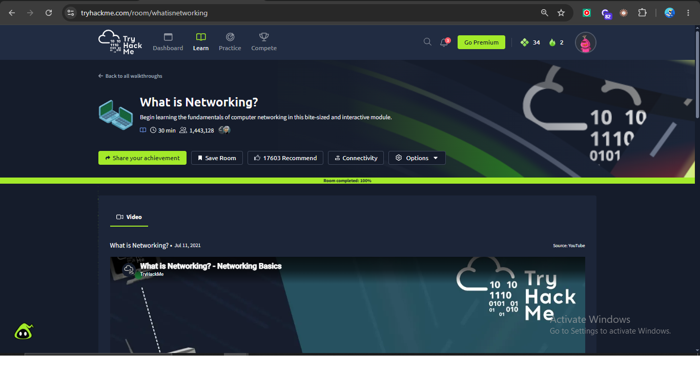


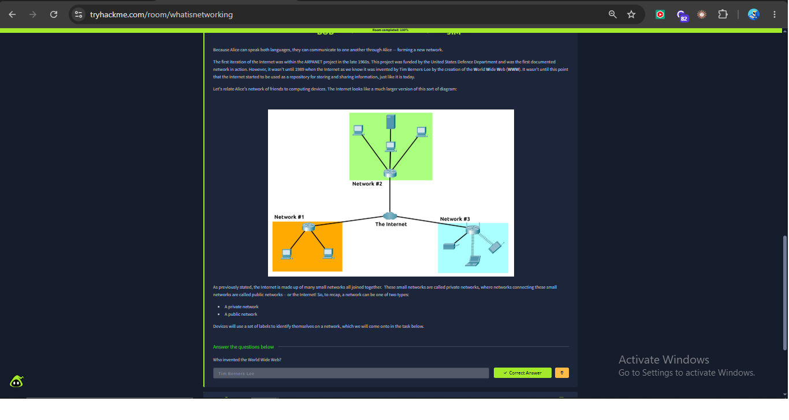

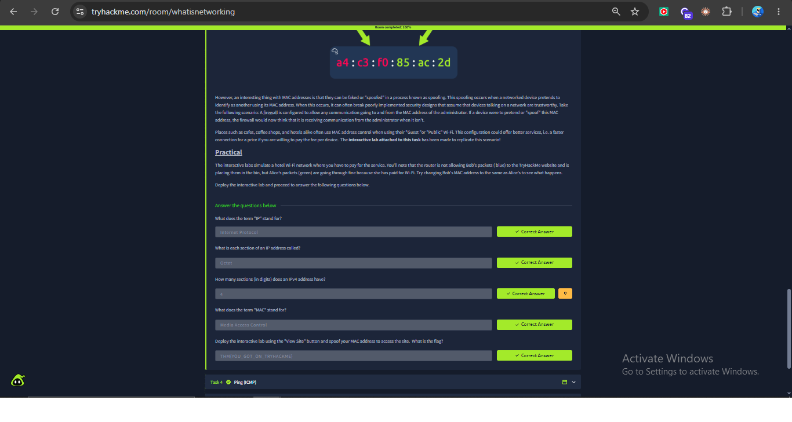

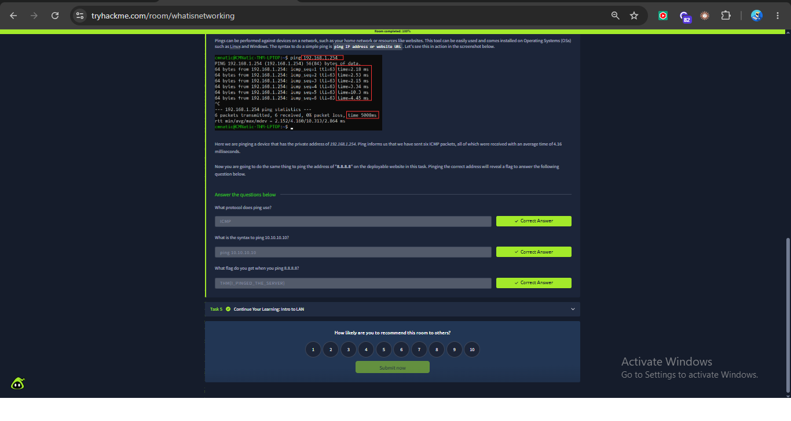

---

## 3.2 OSI Model Requirement — Free Alternative

The originally listed **OSI Model** room was checked, but the room displayed a Premium/subscription lock.

### Premium-access evidence

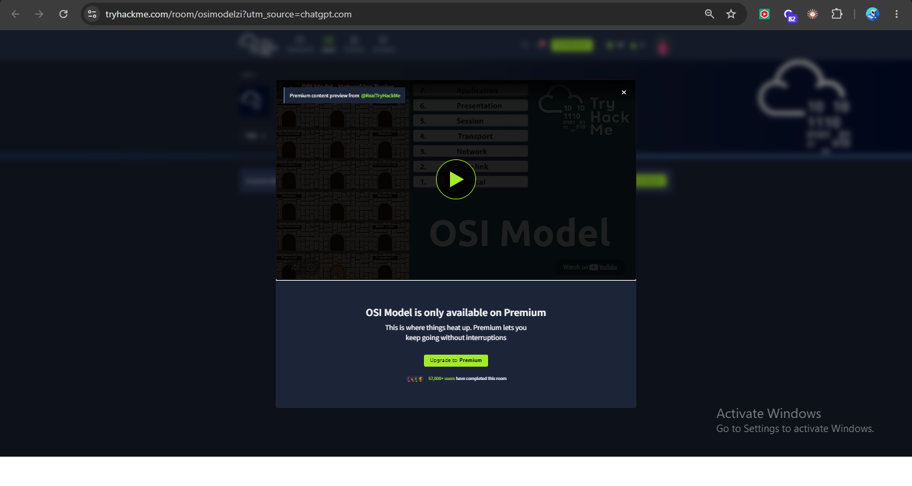

To follow the internship instruction to use a free alternative when a listed room is subscription-locked, the **Networking Concepts** room was completed. Its networking material includes the OSI model and its seven layers.

### Networking Concepts Evidence

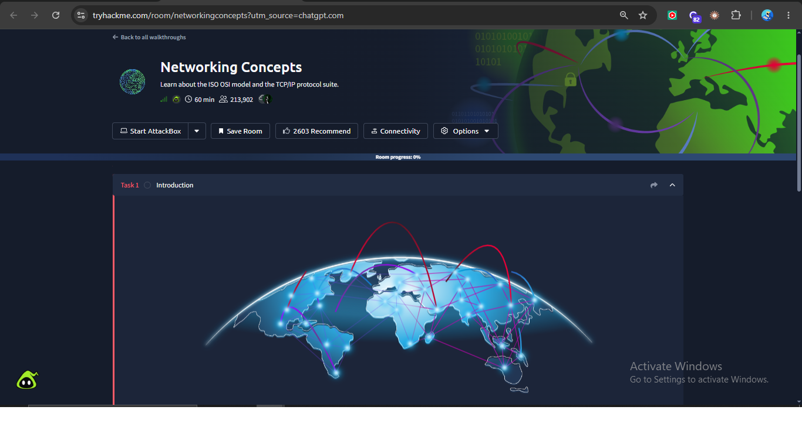

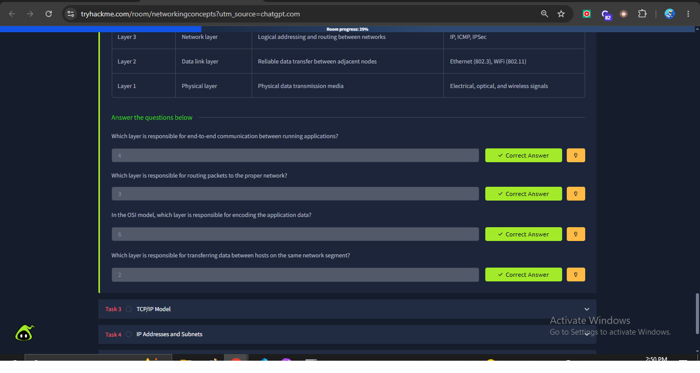

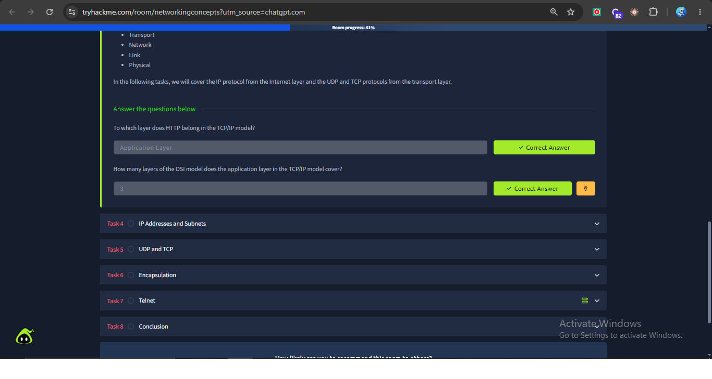

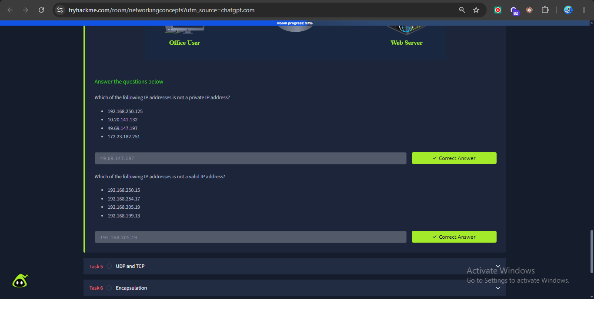

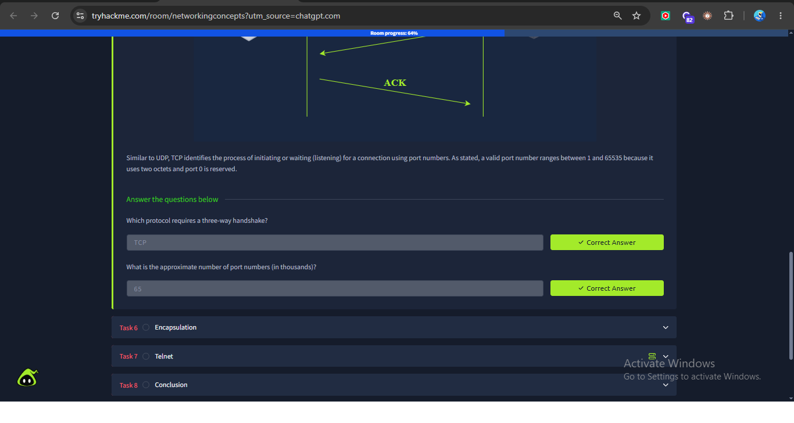

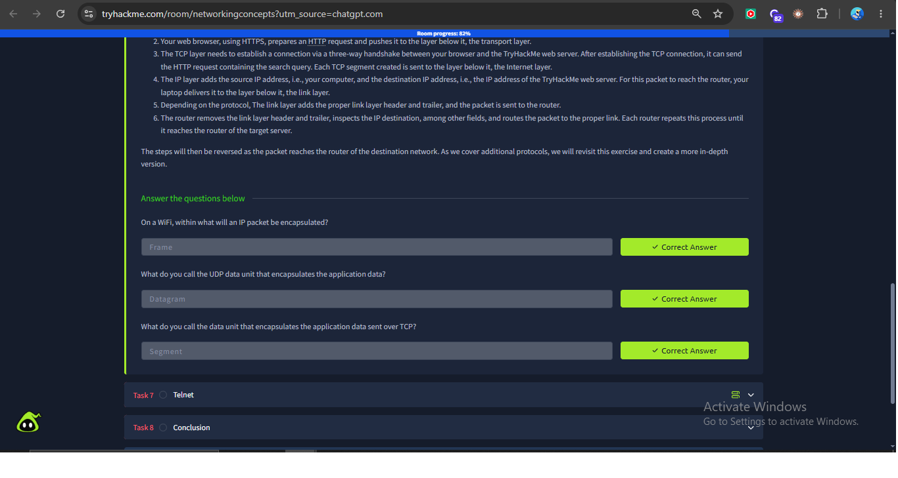

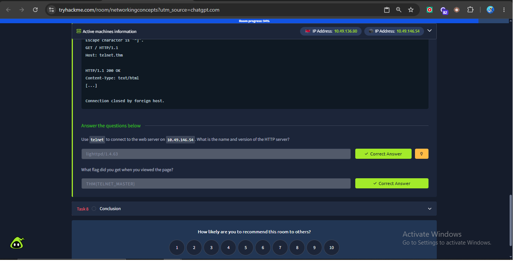

---

## 3.3 DNS Requirement — Free Alternative

The originally listed **DNS in Detail** room was checked, but it displayed a Premium/subscription lock.

### Premium-access evidence


A free alternative, **Introductory Networking**, was used for the DNS learning requirement, including the DNS/`dig` material.

### DNS Learning Evidence

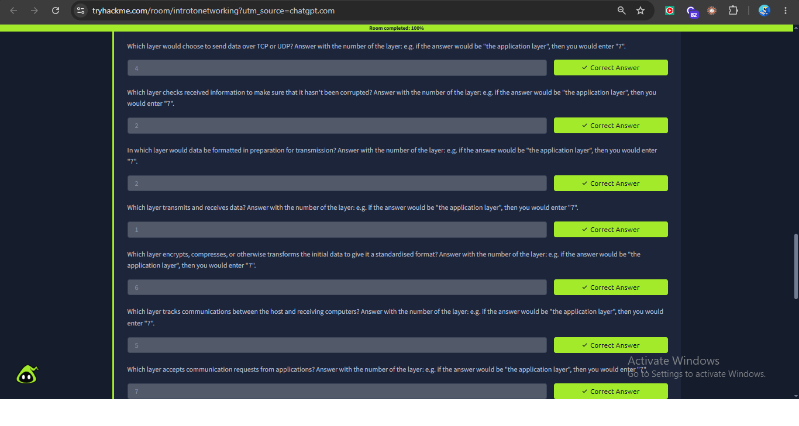

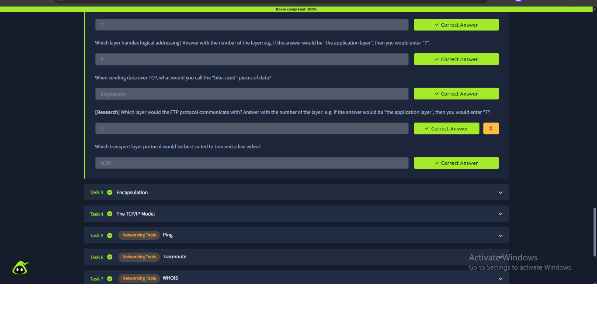

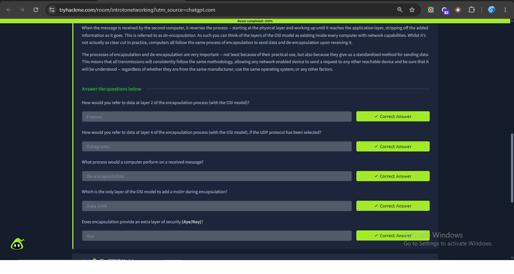

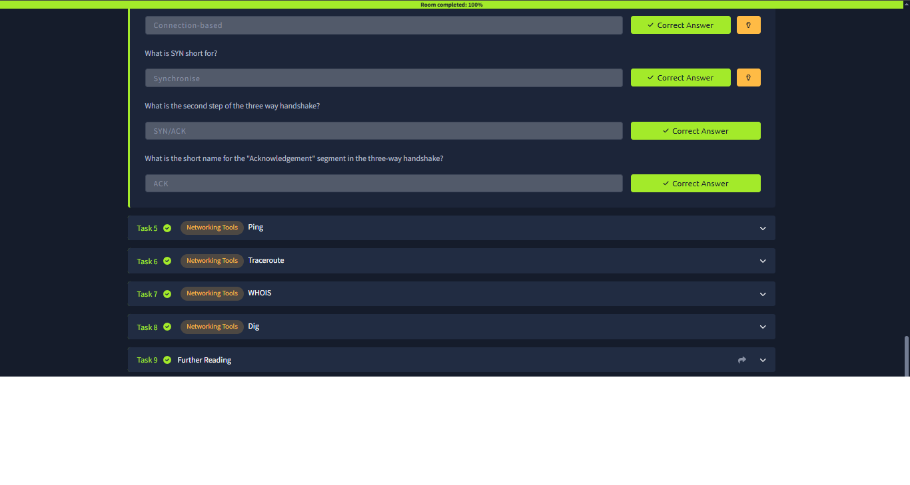

---

# 4. OSI 7-Layer Model

The OSI (Open Systems Interconnection) model is a conceptual framework used to understand how network communication is organized into seven layers.

| Layer | Name | Main Function | Common Examples |
|---:|---|---|---|
| 7 | Application | Provides network services to applications | HTTP, HTTPS, DNS, SMTP, FTP, SSH |
| 6 | Presentation | Handles data representation, encoding, encryption and compression | JPEG, PNG, MIME, Unicode |
| 5 | Session | Establishes, maintains and manages communication sessions | RPC, session services |
| 4 | Transport | Provides end-to-end communication, segmentation and transport reliability | TCP, UDP |
| 3 | Network | Provides logical addressing and routing between networks | IP, ICMP, IPSec |
| 2 | Data Link | Provides communication between devices on the same local network | Ethernet, Wi-Fi |
| 1 | Physical | Transmits raw bits through physical or wireless media | Cables, fiber, radio |

## 4.1 OSI Model — Defender Perspective

| Layer | Defender Relevance |
|---:|---|
| 7 — Application | Analyze application protocols such as HTTP and DNS and detect suspicious application activity. |
| 6 — Presentation | Understand encryption, encoding and data representation. |
| 5 — Session | Consider session establishment, maintenance and abnormal session behavior. |
| 4 — Transport | Investigate TCP/UDP connections, ports, connection attempts and unusual traffic patterns. |
| 3 — Network | Investigate source/destination IP addresses and routing behavior. |
| 2 — Data Link | Understand local-network communication, MAC addresses and Ethernet/Wi-Fi behavior. |
| 1 — Physical | Understand the physical or wireless medium carrying the traffic. |

## 4.2 Data Flow

When data is sent, it moves down the networking stack toward the physical medium. At the receiving system, the process is reversed.

```text
Application
     ↓
Presentation
     ↓
Session
     ↓
Transport
     ↓
Network
     ↓
Data Link
     ↓
Physical
```

For a SOC analyst, this model helps identify **where** a network event is occurring and which information should be investigated.

---

# 5. Common Network Ports

Ports allow network services to be identified on a host. A SOC analyst frequently sees port numbers in firewall logs, IDS/IPS alerts, packet captures, endpoint telemetry and network connections.

| Port | Protocol / Service | Transport | Common Purpose | Defender Relevance |
|---:|---|---|---|---|
| 21 | FTP | TCP | File Transfer Protocol | Unencrypted FTP can expose credentials/data. |
| 22 | SSH | TCP | Secure remote administration | Monitor unusual remote logins and brute-force attempts. |
| 23 | Telnet | TCP | Remote administration | Insecure because traffic is normally unencrypted. |
| 25 | SMTP | TCP | Email transfer | Useful when investigating mail traffic and abuse. |
| 53 | DNS | UDP/TCP | Domain name resolution | Important for detecting suspicious domains and DNS activity. |
| 80 | HTTP | TCP | Web traffic | Clear-text web traffic can be inspected for suspicious activity. |
| 110 | POP3 | TCP | Email retrieval | Older email protocol; monitor for unexpected use. |
| 443 | HTTPS | TCP | Encrypted web traffic | Common legitimate traffic but also used by attackers for C2 and malicious websites. |
| 445 | SMB | TCP | Windows file/printer sharing | High-value monitoring point because SMB is commonly targeted for lateral movement. |
| 3389 | RDP | TCP | Remote Desktop | Monitor unexpected or internet-exposed RDP connections and brute-force attempts. |

## 5.1 Required Ports in Focus

### Port 22 — SSH

SSH is used for secure remote administration.

```text
Client ───── TCP/22 ─────> SSH Server
```

Defensive concern: repeated failed logins, unusual source IPs, or unexpected remote administration can indicate brute-force activity or unauthorized access.

### Port 80 — HTTP

HTTP is commonly used for web communication without transport encryption.

```text
Client ───── TCP/80 ─────> Web Server
```

Defensive concern: suspicious URLs, unusual requests, exploitation attempts and clear-text sensitive information.

### Port 443 — HTTPS

HTTPS is HTTP protected by TLS.

```text
Client ───── TCP/443 ─────> HTTPS Server
```

Defensive concern: encrypted traffic is normal, but attackers also use HTTPS for malicious websites and command-and-control communication.

### Port 53 — DNS

DNS resolves domain names into IP addresses.

```text
Client ───── DNS/53 ─────> DNS Resolver
```

Defensive concern: suspicious domains, abnormal query volume, unusual DNS patterns and possible DNS tunneling.

### Port 445 — SMB

SMB is widely used for Windows file and printer sharing.

```text
Windows Host ───── TCP/445 ─────> Windows Host
```

Defensive concern: unexpected SMB connections can be associated with lateral movement, unauthorized file sharing or exploitation.

### Port 3389 — RDP

RDP allows remote graphical access to Windows systems.

```text
Remote Client ───── TCP/3389 ─────> Windows Host
```

Defensive concern: internet-exposed RDP and repeated failed logins are common security risks.

---

# 6. How DNS Works

DNS (Domain Name System) translates human-readable domain names into IP addresses that computers can use for communication.

For example:

```text
www.example.com
       ↓
DNS resolution
       ↓
IP address
```

## 6.1 DNS Resolution Flow

A simplified resolution process is:

```text
User enters a domain
        ↓
Local hosts file / local cache checked
        ↓
Recursive DNS resolver
        ↓
Root DNS server
        ↓
TLD DNS server (.com, .org, etc.)
        ↓
Authoritative DNS server
        ↓
IP address returned
        ↓
Client connects to the destination
```

## 6.2 Main DNS Components

### Recursive Resolver

The recursive resolver performs the lookup on behalf of the client and may return a cached answer.

### Root Server

The root DNS system directs the resolver toward the correct Top-Level Domain (TLD) servers.

### TLD Server

The TLD server handles domains such as `.com`, `.org`, `.net`, and country-code TLDs.

### Authoritative DNS Server

The authoritative server holds the authoritative DNS records for the requested domain.

### DNS Cache and TTL

DNS answers can be cached to reduce repeated lookups. TTL (Time To Live) determines how long a cached DNS record can normally be retained before it needs to be refreshed.

## 6.3 Defender Perspective

DNS is important to a SOC analyst because attackers may use malicious domains for:

- Phishing
- Malware delivery
- Command-and-control communication
- Data exfiltration
- DNS tunneling

Therefore, DNS logs can provide useful evidence during an investigation.

---

# 7. Normal vs Suspicious Traffic

## 7.1 Example of Normal Traffic

A user opens a normal company website.

```text
User
 ↓
DNS query for company.example
 ↓
DNS resolver returns IP
 ↓
Client connects to TCP/443
 ↓
HTTPS communication
 ↓
Website loads
```

Characteristics:

- Expected destination
- Normal DNS lookup
- Standard HTTPS connection
- Normal volume and timing
- No unusual repeated connection attempts

## 7.2 Example of Suspicious Traffic

A workstation suddenly starts communicating with an unfamiliar external domain.

```text
Workstation
     ↓
Repeated DNS queries
     ↓
Unknown/suspicious domain
     ↓
Connection to unusual external IP
     ↓
Repeated outbound HTTPS traffic
```

Possible warning signs:

- Unknown domain
- Unusual DNS query frequency
- Unexpected external destination
- Repeated connections
- Traffic occurring outside normal user activity
- Connection from a host that normally does not communicate externally

### SOC Analyst Response

A defender could investigate:

1. Source IP/host
2. Destination IP/domain
3. Destination port
4. DNS queries
5. Connection frequency
6. Related endpoint/process activity
7. Whether other hosts show the same behavior

A suspicious connection should be investigated using available logs and security telemetry rather than being declared malicious from a single indicator.

---

# 8. Practical Defender Takeaways

The networking concepts learned in this task connect directly to SOC monitoring.

```text
IP Address
    ↓
Who communicated?

Port
    ↓
Which service was targeted?

Protocol
    ↓
How did they communicate?

DNS
    ↓
Which domain was resolved?

Traffic pattern
    ↓
Is the communication normal or unusual?

SOC Investigation
    ↓
Determine risk and investigate further
```

Understanding networking therefore helps a defender interpret firewall logs, packet captures, IDS/IPS alerts, endpoint telemetry and other security events.

---

# 9. Evidence Summary

The following original screenshots are included in this report:

- `thm1.png` through `thm5.png` — What is Networking evidence
- `2thm1.png` — OSI Model Premium-lock evidence
- `2thm2.png` through `2thm8.png` — Networking Concepts evidence
- `3thm1.png` — DNS in Detail Premium-lock evidence
- `3thm2.png` through `3thm5.png` — Introductory Networking / DNS evidence
- `linkedin1.png`, `linkedin2.png`, `linkedin3.png` — publication/profile evidence supplied with the project

All original filenames have been preserved.

---

# 10. Conclusion

This task established the networking foundation required for defensive cybersecurity work. The practical learning covered basic networking, the OSI model, DNS, protocols, ports and network communication.

From a SOC perspective, these concepts are important because security alerts frequently contain IP addresses, ports, protocols, DNS queries and connection information. Understanding these fundamentals allows an analyst to interpret network events and distinguish expected communication from activity that requires further investigation.

**Project Status: Completed**
