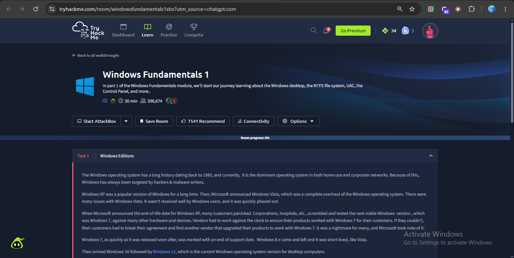
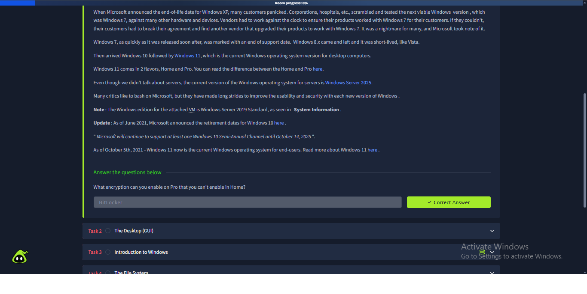
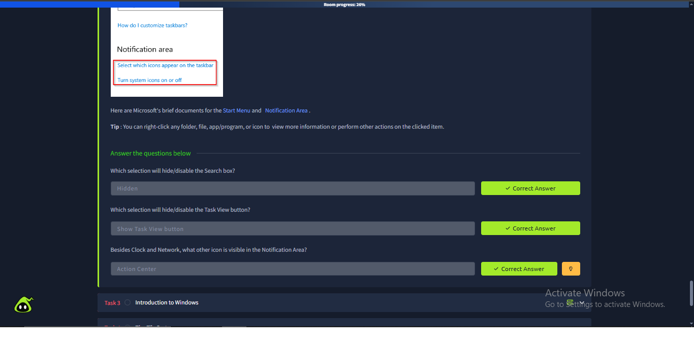
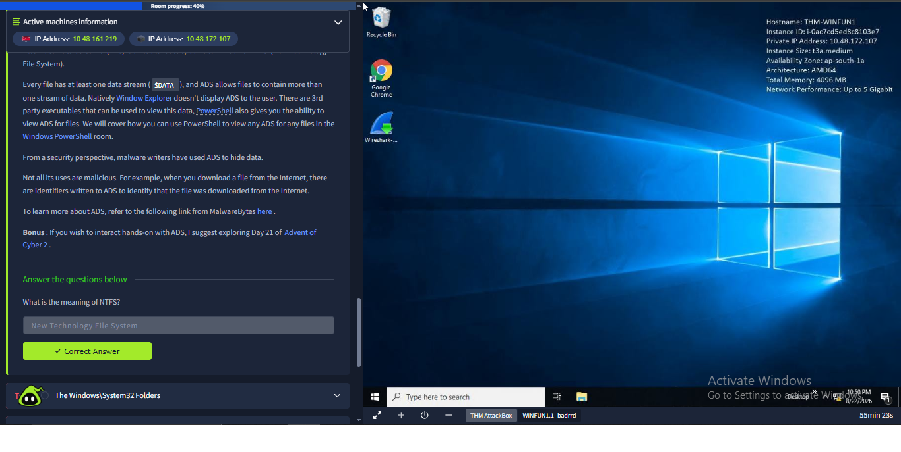
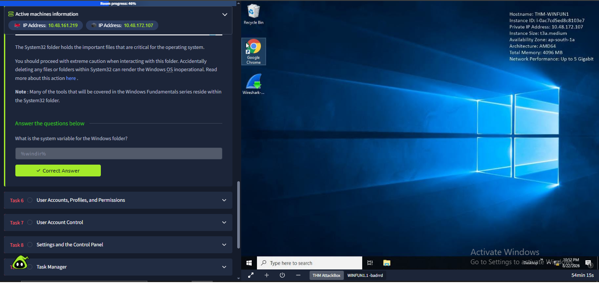
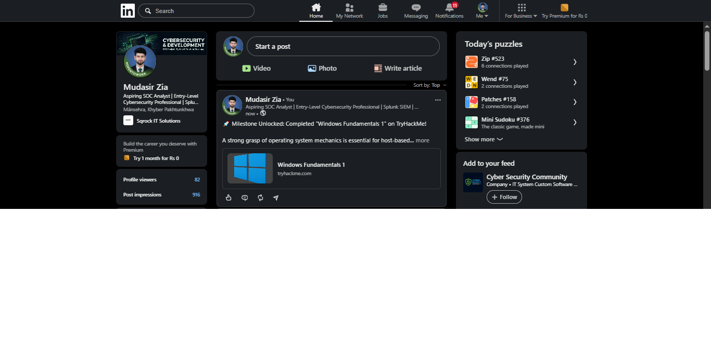
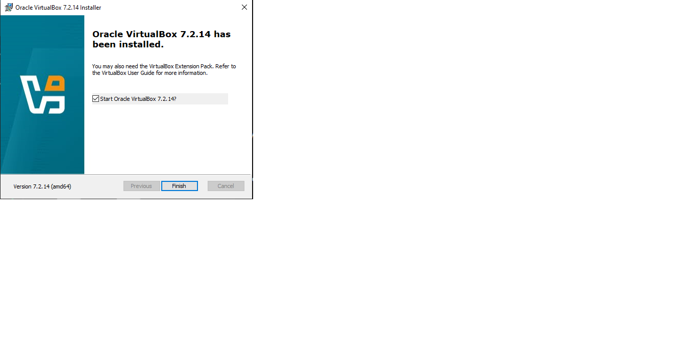
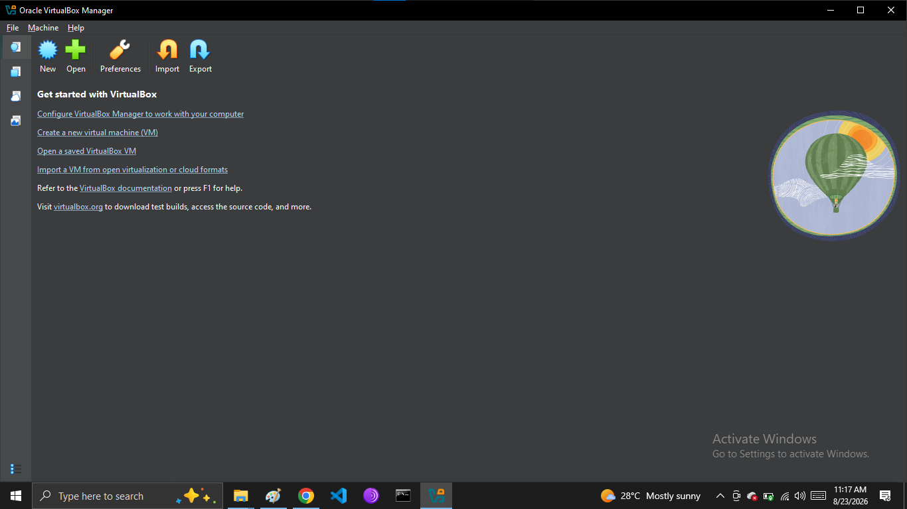
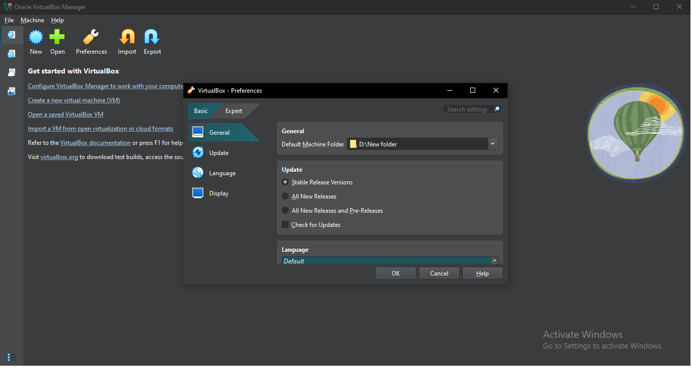
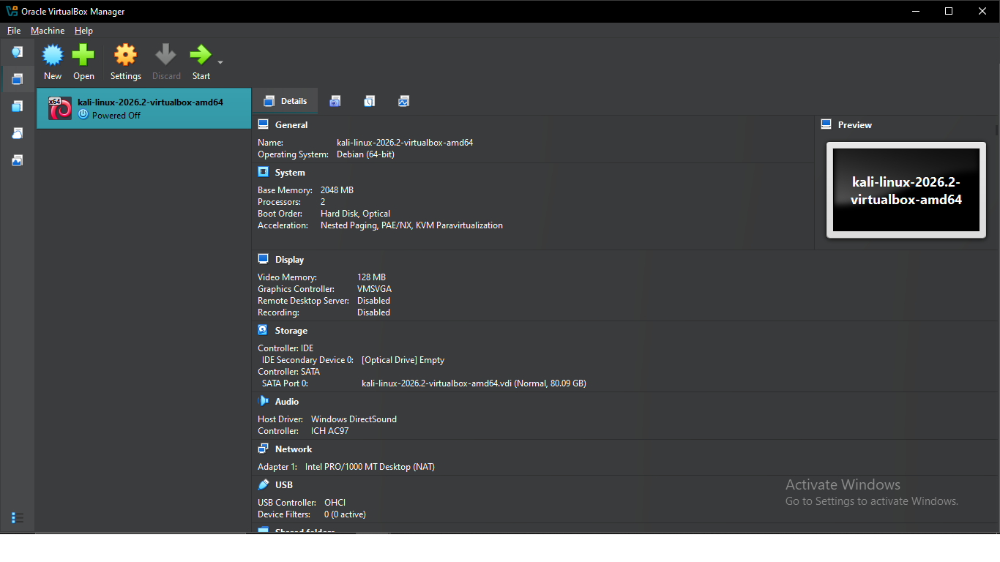

# Week 1 — Task 3: Lab Setup Report

**Domain:** Cyber Security  
**Internship Task:** Week 1 · Task 3  
**Topic:** Lab Setup — VirtualBox + Kali/Ubuntu + Windows VM

---

## 1. Introduction

This report documents the practical work completed for **Week 1 · Task 3 — Lab Setup**.

The purpose of this task was to understand and begin building a basic cybersecurity and Security Operations Center (SOC) laboratory environment using virtualization.

A SOC lab provides a controlled environment where cybersecurity professionals can practice:

- System administration
- Networking
- Log analysis
- Security monitoring
- SIEM operations
- Incident investigation

The assigned task required:

- Installing Oracle VirtualBox
- Setting up a Kali Linux or Ubuntu environment
- Setting up a Windows analysis environment
- Understanding internal networking
- Testing connectivity between systems
- Completing TryHackMe Windows Fundamentals 1
- Collecting practical screenshot evidence

---

## 2. Task Objectives

The objectives of this project were:

1. Install Oracle VirtualBox.
2. Prepare a Kali Linux or Ubuntu environment.
3. Prepare a Windows environment for analysis.
4. Understand how virtual machines communicate through networking.
5. Test connectivity between lab systems.
6. Complete TryHackMe Windows Fundamentals 1.
7. Document the practical work with screenshots.

---

# 3. TryHackMe — Windows Fundamentals 1

The required **Windows Fundamentals 1** TryHackMe learning activity was completed.

The room provided learning about Windows fundamentals and concepts relevant to cybersecurity and SOC analysis.

## Screenshot Evidence

### TryHackMe Evidence 1



### TryHackMe Evidence 2



### TryHackMe Evidence 3



### TryHackMe Evidence 4



### TryHackMe Evidence 5



### TryHackMe Evidence 6



---

# 4. VirtualBox Installation

Oracle VirtualBox was installed on the Windows host system.

VirtualBox is a virtualization platform that allows multiple operating systems to run as virtual machines on a single physical computer.

Virtualization is important in cybersecurity because separate environments can be used for:

- Linux security testing
- Windows analysis
- Network testing
- Log generation
- Security monitoring
- SOC investigations

## Screenshot Evidence

### VirtualBox Installation


### VirtualBox Setup



---

# 5. Virtual Machine Storage Preparation

The Windows host system had limited available storage on the main C: drive.

Because of this limitation, the VirtualBox machine storage location was prepared on the D: drive.

This helps prevent virtual machine files from consuming the limited free space available on the Windows system drive.

## Screenshot Evidence

### VirtualBox Storage Configuration



### Virtual Machine Storage Preparation


### Additional VirtualBox Configuration



### Additional Setup Evidence



---

# 6. Windows Network Information

The Windows host network configuration was reviewed using the following command:

```cmd
ipconfig
