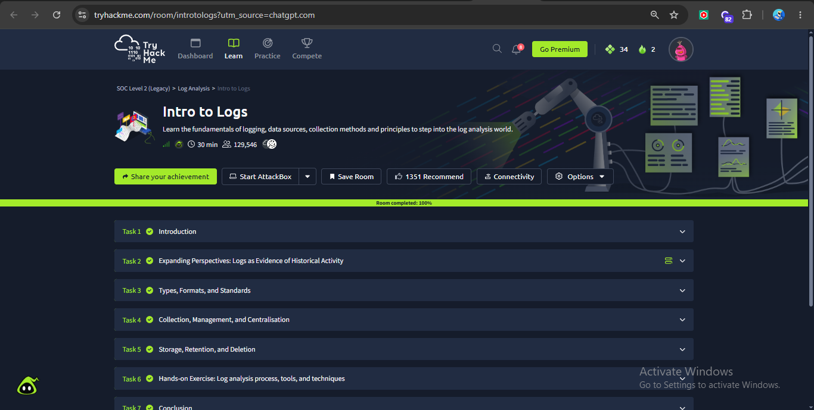
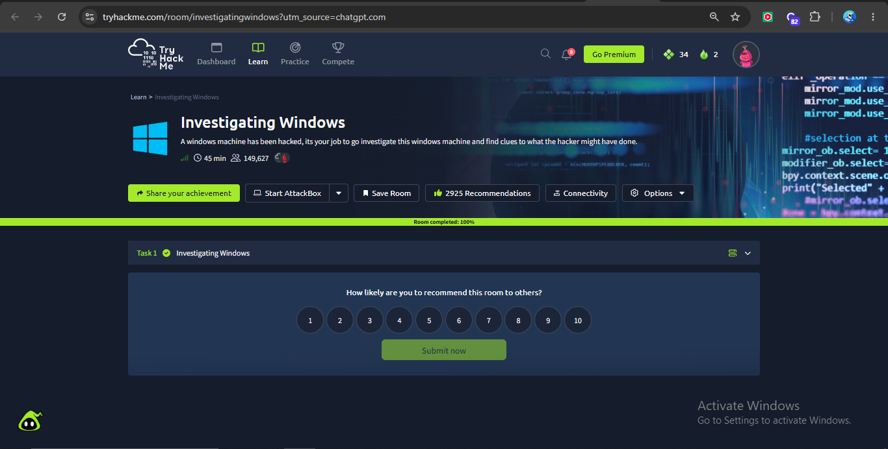

# 🔍 Understanding Logs & Log Analysis Basics


## 📌 Project Overview

This report documents the completion of the **Understanding Logs & Log Analysis Basics** task for the TechBiz Security SOC Analyst Internship.

The practical work focused on understanding common log sources, reading log formats, analyzing an Apache web-server log entry, comparing normal and suspicious activity, identifying patterns and anomalies, and understanding the importance of establishing a baseline.

---

# 🧪 TryHackMe Completion Proof

## Intro to Logs

The **Intro to Logs** room was completed successfully. The room covered logging fundamentals, log types, formats, standards, collection, storage, retention, and the log-analysis process.



## Investigating Windows

The **Investigating Windows** room was completed successfully. The room provided practical exposure to investigating Windows activity and understanding evidence available through Windows systems and logs.



---

# 1. 📊 Five Common Log Types and Their Sources

| Log Type | Where It Comes From | What It Records | SOC Analyst Use |
|---|---|---|---|
| **System Logs** | Operating systems such as Linux and Windows | System events, services, errors, startup and shutdown activity | Detect system failures and unusual system activity |
| **Security Logs** | Windows Event Viewer, Linux authentication logs, and security tools | Logins, failed logins, account changes, and authentication events | Detect brute-force attempts and unauthorized access |
| **Application Logs** | Applications and software | Errors, user activity, transactions, and application events | Identify application failures and suspicious behavior |
| **Network Logs** | Firewalls, routers, IDS/IPS, and network monitoring tools | Connections, IP addresses, ports, protocols, and traffic activity | Detect malicious connections and unusual network behavior |
| **Web Server Logs** | Apache and Nginx web servers | HTTP requests, client IPs, URLs, user activity, and status codes | Detect scanning, attacks, and suspicious web requests |

## Practical Observation

A SOC analyst gains better context by correlating information from different log sources. For example, repeated failed Windows logins combined with repeated network connections from the same source may indicate a brute-force attempt rather than an isolated user mistake.

---

# 2. 🌐 Apache Web-Server Log Analysis

The following is a representative Apache access-log entry:

```text
192.168.1.50 - - [30/Aug/2026:10:15:32 +0500] "GET /index.html HTTP/1.1" 200 4523
```

## Log Line Breakdown

| Field | Value | Meaning |
|---|---|---|
| **Client IP Address** | `192.168.1.50` | The IP address of the device making the request |
| **Timestamp** | `30/Aug/2026:10:15:32 +0500` | The date, time, and timezone when the request occurred |
| **HTTP Method** | `GET` | The client requested information from the server |
| **Requested Resource** | `/index.html` | The webpage or resource requested |
| **Protocol** | `HTTP/1.1` | The HTTP protocol version used |
| **Status Code** | `200` | The request was successfully processed |
| **Response Size** | `4523` | The number of bytes returned by the server |

### Analysis

This entry appears normal because the client requested a legitimate webpage and received an HTTP `200 OK` response. No obvious malicious path, unusual request method, or repeated error pattern is visible in this single event.

---

# 3. ⚖️ Normal vs Suspicious Log Entries

## Normal Activity

```text
192.168.1.50 - - [30/Aug/2026:10:15:32 +0500] "GET /index.html HTTP/1.1" 200 4523
```

### Why It Appears Normal

- The client requested a common webpage.
- The request used the standard `GET` method.
- The server successfully returned the requested resource.
- No sensitive or unusual path is being targeted.
- There is no suspicious repetition visible.

**Classification: Normal Activity**

---

## Suspicious Activity

```text
203.0.113.25 - - [30/Aug/2026:10:16:04 +0500] "GET /admin HTTP/1.1" 404 512
203.0.113.25 - - [30/Aug/2026:10:16:06 +0500] "GET /administrator HTTP/1.1" 404 512
203.0.113.25 - - [30/Aug/2026:10:16:08 +0500] "GET /wp-admin HTTP/1.1" 404 512
203.0.113.25 - - [30/Aug/2026:10:16:10 +0500] "GET /.env HTTP/1.1" 404 512
```

### Why It Is Suspicious

The same IP address requests multiple sensitive or commonly targeted resources within a few seconds:

- `/admin`
- `/administrator`
- `/wp-admin`
- `/.env`

All requests return `404 Not Found`. One 404 response can be normal, but repeated requests for sensitive paths from the same source create a pattern consistent with automated enumeration or web scanning.

**Classification: Suspicious Activity — Possible Web Enumeration or Automated Scanning**

---

# 4. 🔎 Pattern and Anomaly Analysis

A SOC analyst should avoid classifying every isolated event as malicious. Context is obtained by identifying patterns.

## Frequency

- **One failed login:** may be a normal user mistake.
- **Hundreds of failed logins:** may indicate a brute-force attack.

## Timing

- Requests spread across several hours may be normal.
- Many requests within seconds may indicate automation.

## Source

- One IP browsing normal website pages may be expected behavior.
- One IP repeatedly probing administrative and sensitive paths requires investigation.

## Behavior

Normal browsing may look like:

```text
/index.html → /products → /contact
```

Suspicious reconnaissance may look like:

```text
/admin → /wp-admin → /.env → /phpmyadmin
```

### Key Finding

A single event provides evidence, but a sequence of related events provides context. Pattern analysis helps analysts distinguish normal activity from potential threats.

---

# 5. 📈 Understanding a Baseline

A **baseline** is an established understanding of normal activity for a system, application, user, or network.

Before identifying an anomaly, an analyst must understand what is expected.

## Example Normal Baseline

A company website may normally receive:

- 500–700 requests per hour.
- Most traffic during business hours.
- Frequent requests for `/index.html`, `/products`, and `/contact`.
- Very few failed requests.
- Traffic patterns consistent with normal user behavior.

## Example Anomaly

An analyst should investigate a sudden change such as:

- 10,000 requests within five minutes.
- Hundreds of requests for `/admin`.
- Repeated `404` responses for sensitive files.
- One source generating thousands of requests.
- Rapid request patterns that are inconsistent with normal users.

## SOC Analyst Workflow

```text
Collect Logs
      ↓
Understand Normal Behavior
      ↓
Create a Baseline
      ↓
Monitor New Events
      ↓
Identify Deviations
      ↓
Investigate Patterns
      ↓
Determine Whether Activity Is Suspicious
```

---

# 🎯 Practical Learning Completed

Through this task, I practiced and understood:

- Identifying major log types and their data sources.
- Reading common log fields such as timestamps, IP addresses, requests, and status codes.
- Breaking down an Apache web-server access log.
- Comparing normal and suspicious activity.
- Identifying suspicious patterns based on frequency, timing, source, and behavior.
- Understanding why a baseline is necessary for anomaly detection.
- Using log evidence to develop context during an investigation.

---

# 🏁 Conclusion

Logs are one of the primary sources of evidence used by SOC analysts. Effective log analysis requires more than reading individual events: an analyst must understand the log source, interpret fields correctly, establish a baseline of normal behavior, and identify patterns that deviate from that baseline.

This task provided foundational practice in recognizing how normal and suspicious activity can appear in logs and how repeated events provide stronger investigative context than isolated events.
