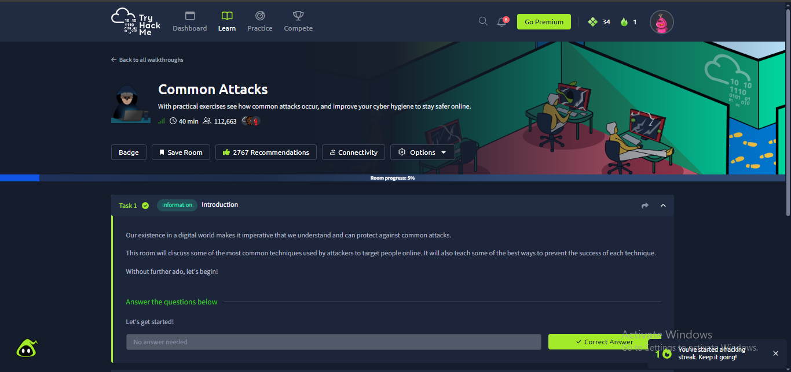
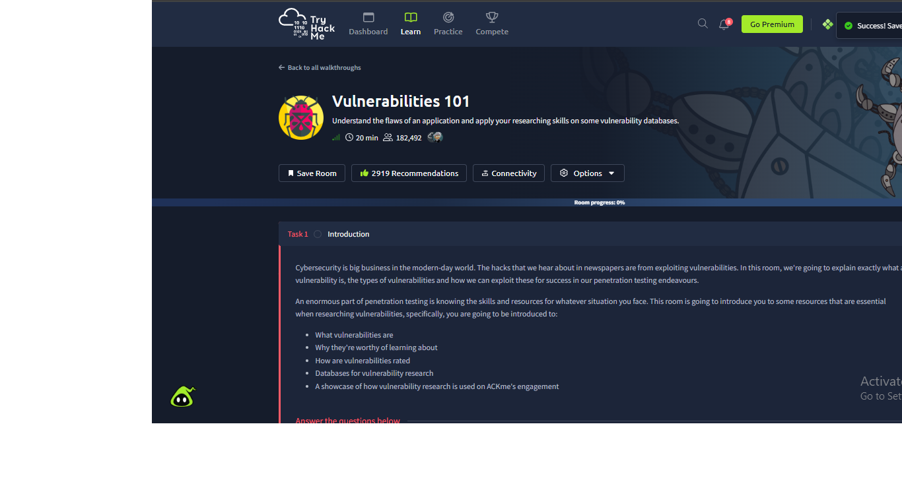

# Week 2 Task 7 — Malware Types & Common Attacks

## 1. Introduction

This project focuses on understanding common malware types and common cyber attacks from a cybersecurity and defensive perspective. The required practical learning was completed through TryHackMe.

## 2. Learning Objectives

The project objectives were to:

1. Identify six common malware types.
2. Explain common attacks including phishing, DoS/DDoS, brute force, and MITM.
3. Understand how ransomware spreads and its impact.
4. Identify practical detection signs or indicators for common attacks.
5. Complete the required TryHackMe rooms with evidence.

## 3. Malware Types

| Malware Type | Definition |
|---|---|
| **Virus** | Malicious code that attaches itself to a legitimate file or program and executes when the host is run. |
| **Worm** | Malware capable of self-propagation across systems or networks without needing to attach to a host file. |
| **Trojan** | Malicious software disguised as legitimate software or content to trick a user into executing it. |
| **Ransomware** | Malware that denies access to data or systems, commonly by encrypting files, and demands payment. |
| **Spyware** | Malware that secretly monitors activity or collects information from a victim. |
| **Rootkit** | Malware or a collection of tools designed to hide malicious activity and maintain privileged access. |

## 4. Common Cyber Attacks

### 4.1 Phishing

Phishing is a social-engineering attack in which an attacker uses deceptive messages, websites, or other communications to trick a victim into revealing information, opening malicious content, or performing an unsafe action.

**Detection signs:**
- Suspicious sender address or domain.
- Unexpected links or attachments.
- Urgent or threatening language.
- Login pages with suspicious URLs.

### 4.2 DoS/DDoS

A Denial-of-Service attack attempts to make a service unavailable by overwhelming a system or network resource. A Distributed Denial-of-Service attack uses multiple sources to generate the traffic.

**Detection signs:**
- Sudden and unusual traffic volume.
- Large numbers of repeated requests.
- Increased latency or service failures.
- Abnormal source-IP distribution.

### 4.3 Brute Force

A brute-force attack repeatedly attempts passwords or other authentication values until the correct credential is discovered.

**Detection signs:**
- Numerous failed login events.
- Repeated authentication attempts in a short period.
- Multiple accounts targeted from one source.
- Successful login immediately following many failures.

### 4.4 Man-in-the-Middle (MITM)

A Man-in-the-Middle attack occurs when an attacker intercepts communication between two parties and may monitor or manipulate the traffic.

**Detection signs:**
- Unexpected certificate warnings.
- Suspicious network changes.
- Unusual ARP or DNS behavior.
- Unexpected traffic routing or interception indicators.

## 5. Ransomware — Spread and Impact

Ransomware can reach victims through phishing emails, malicious downloads, compromised credentials, or exploitation of vulnerable systems. Once established, ransomware may encrypt files and disrupt business or personal operations.

Potential impact includes:

- Loss of access to important files.
- Operational downtime.
- Recovery and incident-response costs.
- Potential theft or exposure of sensitive information.
- Business and reputational damage.

From a defensive perspective, useful controls include regular offline/immutable backups, timely patching, endpoint protection, strong authentication, network segmentation, and user awareness training.

## 6. TryHackMe Practical Work

### Required Room 1 — Common Attacks

The **Common Attacks** room was completed as part of the practical learning requirement.

### Required Room 2 — Vulnerabilities 101

The **Vulnerabilities 101** room was completed as the second required practical component.

## 7. Defensive Detection Summary

| Attack | Useful Indicator |
|---|---|
| Phishing | Suspicious sender, URL, attachment, or login page |
| DoS/DDoS | Abnormal traffic spike and service degradation |
| Brute Force | Repeated authentication failures |
| MITM | Certificate, DNS, ARP, or traffic-routing anomalies |
| Ransomware | Rapid file changes/encryption, unusual processes, or ransom notes |

## 8. Conclusion

This project strengthened the understanding of common malware categories, attack techniques, ransomware risks, and practical detection indicators. Completing the two required TryHackMe rooms provided hands-on exposure to common attack and vulnerability concepts.

## 9. Evidence Note

All screenshots in this report are the original image files supplied for this project. No fabricated screenshots have been added.