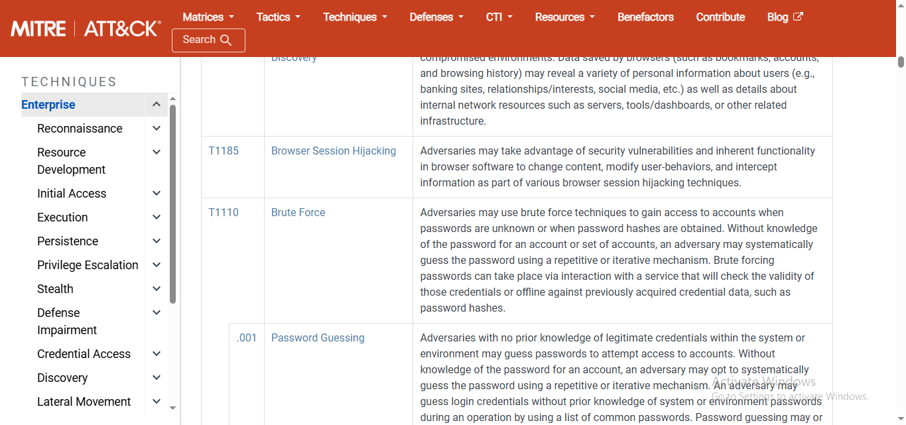

# Week 2 Task 8 — Cyber Kill Chain + MITRE ATT&CK Intro

## 1. Introduction
This project introduces the Lockheed Martin Cyber Kill Chain and MITRE ATT&CK for understanding adversary behavior and mapping security alerts.

## 2. Cyber Kill Chain — Seven Stages

| Stage | Description |
|---|---|
| **1. Reconnaissance** | Research, identify, and select targets and gather useful information. |
| **2. Weaponization** | Prepare a malicious payload or deliverable capability. |
| **3. Delivery** | Transmit the payload to the target. |
| **4. Exploitation** | Trigger malicious code through a vulnerability, application behavior, or user action. |
| **5. Installation** | Establish a malicious presence on the target system. |
| **6. Command & Control (C2)** | Establish communication for adversary control or interaction. |
| **7. Actions on Objectives** | Perform the intended mission, such as theft, disruption, or data manipulation. |

Lockheed Martin describes the Cyber Kill Chain as a seven-step model for identifying and preventing cyber intrusion activity.

## 3. MITRE ATT&CK Introduction
MITRE ATT&CK organizes adversary behavior into tactics and techniques. Tactics describe the adversary's goal, while techniques describe how that goal may be achieved.

## 4. Selected Technique — T1110 Brute Force

**Technique:** T1110 — Brute Force  
**Tactic:** Credential Access

Brute Force covers techniques used to gain access to accounts when credentials are unknown through systematic or repetitive attempts.

### T1110 Sub-techniques
- **T1110.001 — Password Guessing**
- **T1110.002 — Password Cracking**
- **T1110.003 — Password Spraying**
- **T1110.004 — Credential Stuffing**

MITRE also documents repeated authentication failures and possible subsequent successful logins as useful detection signals.

## 5. Practical MITRE Evidence

The following is the original screenshot supplied for the MITRE ATT&CK practical activity. It shows the Enterprise techniques matrix, including **T1110 Brute Force**, Credential Access, and Password Guessing.

## 6. Attack Mapping — Phishing-Based Malware Scenario

| Kill Chain Stage | Example Activity |
|---|---|
| **Reconnaissance** | Identify a target user and gather available information. |
| **Weaponization** | Prepare a malicious document or payload. |
| **Delivery** | Deliver the malicious content through a phishing message. |
| **Exploitation** | Victim opens the malicious content and the attack is triggered. |
| **Installation** | Malware establishes a presence on the compromised system. |
| **Command & Control** | The compromised host communicates with attacker-controlled infrastructure. |
| **Actions on Objectives** | The attacker attempts theft, disruption, or another intended objective. |

## 7. Defensive Detection Opportunities

| Stage | Defensive Opportunity |
|---|---|
| Reconnaissance | Monitor suspicious scanning and enumeration. |
| Weaponization | Use threat intelligence and malware analysis. |
| Delivery | Email security, URL filtering, attachment scanning, and user awareness. |
| Exploitation | Patch management, endpoint protection, and exploit detection. |
| Installation | Endpoint monitoring for suspicious processes and persistence. |
| Command & Control | Monitor unusual outbound connections and destinations. |
| Actions on Objectives | DLP, audit logging, access controls, and behavioral analytics. |

## 8. SOC Analyst Relevance
The Cyber Kill Chain provides a high-level sequence of an intrusion, while MITRE ATT&CK provides detailed adversary behaviors. For example, repeated authentication failures can help a SOC analyst investigate possible **T1110 Brute Force** activity.

## 9. Conclusion
This project established a practical foundation for understanding attack lifecycles and adversary behavior. The Cyber Kill Chain provides seven stages, while MITRE ATT&CK provides detailed techniques such as T1110 Brute Force.

## 10. Evidence Integrity
All screenshot evidence included in this report is based on the original image supplied for this project. No fabricated evidence has been added.
