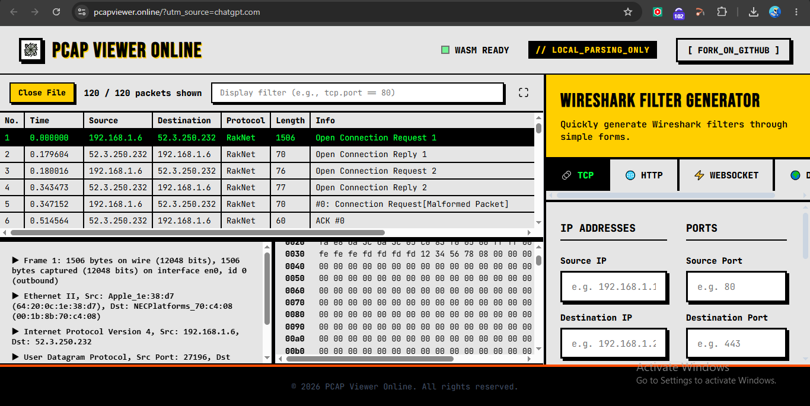
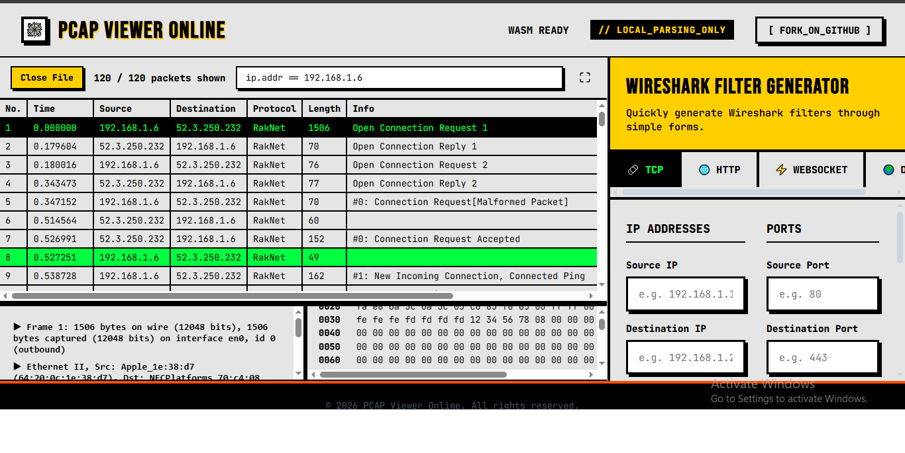
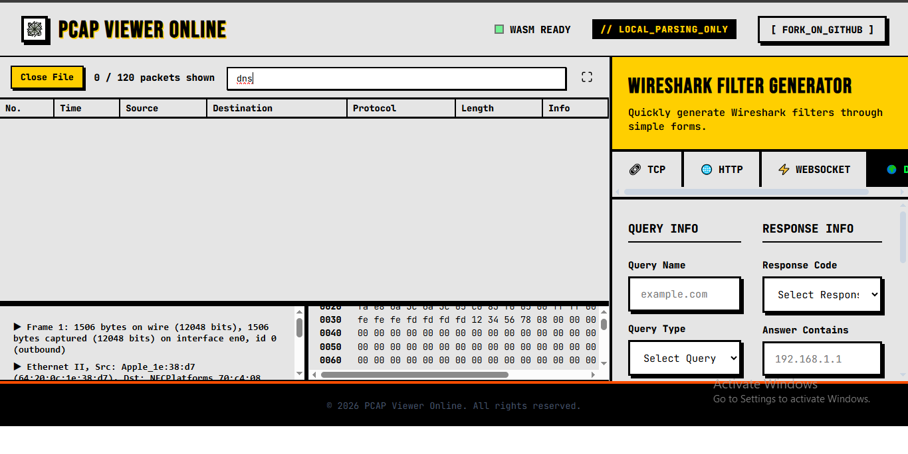
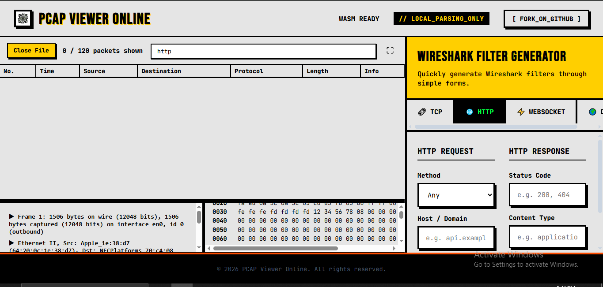
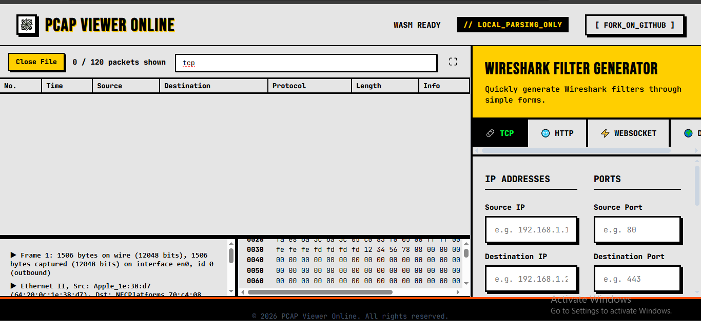

# Week 3 — Task 9: Network Traffic Analysis — Wireshark Basics

## 1. Introduction

Network traffic analysis is a core SOC analyst skill. It involves examining packets and network protocols to understand communication between systems and identify potentially suspicious activity.

This project focused on Wireshark basics, packet captures, display filters, DNS, HTTP, TCP, IP addresses, and basic security analysis.

## 2. Objectives

The objectives were to:

- Understand packet captures.
- Identify common network protocols.
- Use Wireshark display filters.
- Filter traffic by IP address.
- Identify DNS traffic.
- Identify HTTP traffic.
- Identify TCP traffic.
- Inspect an HTTP request.
- Understand plaintext information exposure.
- Recognize suspicious network indicators.

## 3. Packet Capture

The packet capture used during the practical analysis was:

```text
MCPE-0.15.pcapng
```

The capture contained approximately 120 packets.

Packet captures provide a record of network communication that can be examined during security investigations.

An analyst can inspect information such as:

- Source IP
- Destination IP
- Source port
- Destination port
- Protocol
- Packet length
- TCP flags
- DNS queries
- HTTP requests
- HTTP responses

## 4. Screenshot Evidence

### Screenshot 1



### Screenshot 2



### Screenshot 3



### Screenshot 4



### Screenshot 5



## 5. Wireshark Display Filters

Display filters allow an analyst to narrow down a large packet capture and focus on specific traffic.

### 5.1 IP Address Filter

The following filter was used:

```text
ip.addr == 192.168.1.6
```

This filter displays packets where `192.168.1.6` is either the source or destination IP address.

This is useful when investigating communication involving a particular host.

### 5.2 DNS Filter

The following display filter was used:

```text
dns
```

This filter displays DNS-related packets.

DNS analysis can help an analyst investigate:

- Domain lookups
- DNS request frequency
- Suspicious domains
- Unexpected destinations
- Potential command-and-control activity

### 5.3 HTTP Filter

The following display filter was used:

```text
http
```

This filter displays HTTP traffic.

HTTP traffic can contain useful information such as:

- HTTP requests
- HTTP responses
- Hostnames
- URLs
- HTTP methods
- User-Agent information
- Transmitted data

Because HTTP is normally unencrypted, sensitive information may potentially be visible within the packet contents.

### 5.4 TCP Filter

The following display filter was used:

```text
tcp
```

This filter displays TCP packets.

TCP analysis can help identify:

- Network connections
- Source and destination ports
- TCP flags
- Connection establishment
- Connection termination
- Communication patterns

## 6. Network Traffic Concepts

### IP Addresses

IP addresses identify hosts participating in network communication.

During a security investigation, filtering traffic by IP address can help determine what a particular system is communicating with.

For example:

```text
ip.addr == 192.168.1.6
```

can be used to isolate traffic involving a specific host.

### DNS

The Domain Name System (DNS) converts domain names into IP addresses.

For example:

```text
example.com → IP address
```

DNS traffic is valuable during investigations because suspicious domains, repeated lookups, unusual domains, and unexpected DNS destinations may provide indicators of compromise.

### HTTP

HTTP is an application-layer protocol used for web communication.

HTTP traffic is generally transmitted without encryption, meaning information contained in requests and responses may be visible during packet inspection.

This makes HTTP traffic useful when investigating potentially exposed credentials, URLs, parameters, or other transmitted information.

### TCP

Transmission Control Protocol (TCP) provides reliable communication between network hosts.

TCP analysis can help an analyst understand:

- Which systems communicated
- Which ports were used
- When connections were established
- How connections were terminated
- What application protocols may be carried over the connection

## 7. HTTP Request Analysis

An HTTP packet was inspected during the practical exercise.

When analyzing an HTTP request, a SOC analyst can examine fields such as:

- Source IP
- Destination IP
- Source Port
- Destination Port
- HTTP Method
- Host
- Request URI
- User-Agent
- Packet Data

For example, an HTTP request may contain:

```text
GET / HTTP/1.1
Host: example.com
```

Because HTTP is not encrypted by default, packet inspection can potentially reveal information transmitted between the client and server.

### Security Relevance

Plaintext HTTP can expose information that would otherwise be protected when using encrypted protocols such as HTTPS.

Potentially exposed information can include:

- URLs
- HTTP parameters
- Session information
- Application data
- Credentials, if an insecure application transmits them over HTTP

## 8. Understanding Suspicious Network Traffic

A SOC analyst should not assume that every unusual packet represents malicious activity.

Traffic should be investigated in context.

Potential indicators that may require further investigation include:

- Unexpected external IP addresses
- Repeated connections to an unfamiliar destination
- Unusual destination ports
- Large amounts of unexpected traffic
- Suspicious DNS queries
- Communication with known malicious infrastructure
- Cleartext credentials
- Unusual HTTP requests
- Repeated failed connections

These indicators should be correlated with other security data before determining whether an event is malicious.

## 9. SOC Analyst Relevance

Network traffic analysis is directly relevant to Security Operations Center work.

Packet analysis can assist during investigations involving:

- Suspicious IP addresses
- Unexpected network connections
- Malware communication
- Command-and-control traffic
- Suspicious DNS requests
- Unencrypted HTTP traffic
- Possible credential exposure
- Unusual ports and protocols
- Data exfiltration investigations
- Incident response

A SOC analyst can combine packet-capture evidence with:

- Firewall logs
- DNS logs
- Endpoint logs
- Authentication logs
- Proxy logs
- SIEM alerts
- Threat intelligence

This provides a broader view of an incident.

## 10. Practical Skills Demonstrated

| Skill | Description |
|---|---|
| Packet Analysis | Examining individual network packets |
| IP Filtering | Filtering traffic by IP address |
| DNS Analysis | Identifying DNS-related traffic |
| HTTP Analysis | Identifying and inspecting HTTP communication |
| TCP Analysis | Filtering and examining TCP traffic |
| Protocol Identification | Understanding protocols contained in captures |
| HTTP Inspection | Examining HTTP request information |
| Security Analysis | Identifying potentially suspicious network indicators |

## 11. Evidence Summary

The screenshots included in this report provide evidence of the practical work completed for the project.

### Evidence Files

```text
w1.png
w2.png
w3.png
w4.png
w5.png
```

The evidence covers the required learning and practical network traffic analysis activities.

## 12. Repository Structure

```text
Week-3-Task-9-Network-Traffic-Analysis-Wireshark-Basics/
│
├── README.md
├── Week-3-Task-9-Network-Traffic-Analysis-Wireshark-Basics.pdf
│
└── Report/
    ├── report.md
    ├── w1.png
    ├── w2.png
    ├── w3.png
    ├── w4.png
    └── w5.png
```

## 13. Conclusion

This project provided practical exposure to network traffic analysis using Wireshark and packet capture data.

The main skills developed were:

- Understanding packet captures
- Identifying network protocols
- Filtering traffic by IP address
- Filtering DNS traffic
- Filtering HTTP traffic
- Filtering TCP traffic
- Inspecting HTTP requests
- Understanding plaintext information exposure
- Recognizing network indicators relevant to SOC investigations

Network traffic analysis is an important foundation for SOC analysts because packet-level evidence can help explain what happened during a security event and support investigation and incident-response activities.

## 14. Final Status

**Project:** Week 3 — Task 9: Network Traffic Analysis — Wireshark Basics

**Status:** Completed

**Practical Area:** Network Traffic Analysis

**Primary Tool:** Wireshark

**Learning Activity:** TryHackMe — Wireshark: The Basics

**Report:** Completed with practical evidence and screenshots
