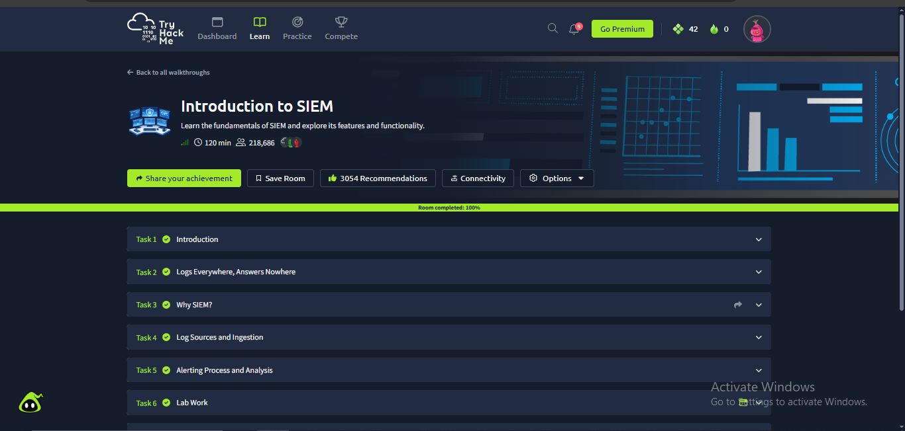
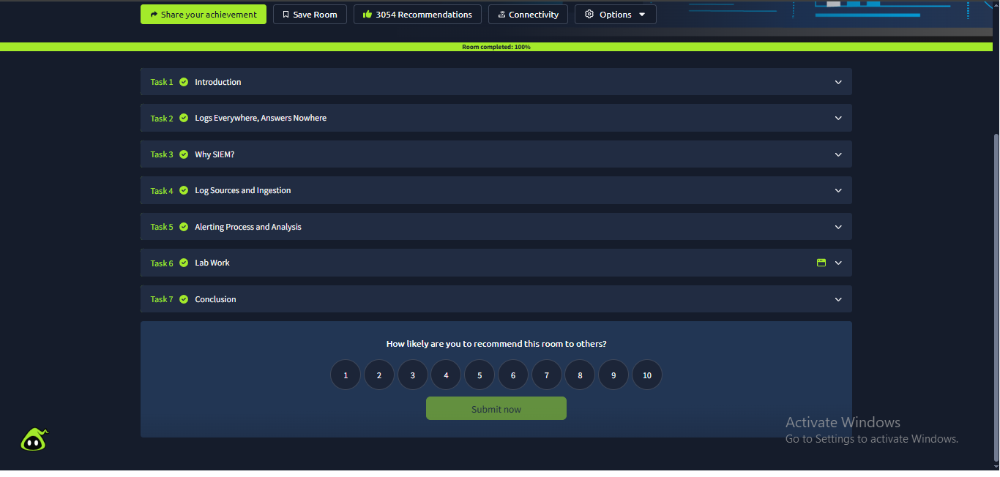

# Week 4 — Task 10: What is SIEM? + Install Splunk / Wazuh


## Project Overview

This project covers the fundamentals of **Security Information and Event Management (SIEM)** and demonstrates a working Splunk-based SIEM lab.

A SIEM collects security-relevant logs from multiple sources, normalizes and correlates data, supports detection and alerting, and provides dashboards for investigation and reporting.

For this task, the existing Splunk lab was reused rather than installing a second SIEM such as Wazuh. This avoided unnecessary resource usage while still completing the required practical objective of accessing a working SIEM dashboard.

## Objectives

- Understand what SIEM means.
- Understand centralized log collection.
- Understand log normalization and correlation.
- Understand alerting and detection.
- Understand SIEM dashboards and reporting.
- Complete the required TryHackMe **Introduction to SIEM** room.
- Access and verify the existing Splunk SIEM environment.
- Document the working dashboard with screenshots.

## What is SIEM?

**SIEM** stands for **Security Information and Event Management**.

A SIEM is a security platform that collects logs and security events from different sources, standardizes the data, correlates related events, detects suspicious activity using rules, and presents the results to security analysts.

Typical SIEM data sources include:

- Windows Event Logs
- Sysmon logs
- Linux authentication and system logs
- Firewall logs
- IDS/IPS logs
- DNS logs
- Web server logs
- Authentication systems
- Cloud services
- Endpoint security tools

## Core SIEM Functions

### 1. Centralized Log Collection

A SIEM gathers logs from multiple systems into a central location. This gives analysts a single place to search and investigate events instead of manually checking every endpoint.

### 2. Log Normalization

Different devices produce logs in different formats. Normalization converts information into a consistent structure so analysts can search and compare events more easily.

### 3. Correlation

Correlation connects related events from different sources. For example, repeated failed logins followed by a successful login and unusual network activity may indicate a compromised account.

### 4. Detection and Alerting

SIEM detection rules identify conditions that may indicate suspicious or malicious behavior. When a rule matches, the SIEM can generate an alert for analyst investigation.

### 5. Dashboards and Reporting

Dashboards summarize security data through visualizations, event counts, alerts, trends, and other useful metrics.

## Three Benefits of SIEM

1. **Centralized visibility** — security events from multiple systems can be investigated from one platform.
2. **Faster detection** — correlation and detection rules can identify suspicious activity more efficiently than manual log review.
3. **Investigation and reporting** — searchable events, alerts, and dashboards provide evidence for incident investigation and reporting.

## Practical Environment

### SIEM Used

**Splunk** was used as the practical SIEM platform. An existing local Splunk environment was already configured with security telemetry, so it was reused instead of installing Wazuh alongside it.

### Working Splunk Evidence


## TryHackMe — Introduction to SIEM

The required TryHackMe **Introduction to SIEM** room was completed. The room covers SIEM fundamentals including log sources, centralized log collection, normalization, correlation, real-time alerting, dashboards, log ingestion, and alert investigation.





## Setup / Verification Steps

1. Opened the existing Splunk environment.
2. Confirmed that the Splunk web interface was reachable.
3. Logged into the configured Splunk administrator interface.
4. Verified that the Splunk home/dashboard interface loaded successfully.
5. Completed the required TryHackMe learning activity.
6. Captured screenshots as evidence.

## SOC Analyst Relevance

A simplified SIEM workflow is:

```text
Log Sources
    ↓
Log Collection / Ingestion
    ↓
Normalization / Parsing
    ↓
Correlation
    ↓
Detection Rules
    ↓
Alert
    ↓
Analyst Investigation
    ↓
Response / Escalation
```

A SOC analyst may investigate failed authentication attempts, suspicious process execution, privilege escalation, persistence, unusual network connections, suspicious DNS activity, malware indicators, and possible data exfiltration.

## Evidence

| File | Evidence |
|---|---|
| `w1.png` | Working Splunk web interface/dashboard |
| `w2.png` | TryHackMe Introduction to SIEM evidence |
| `w3.png` | TryHackMe Introduction to SIEM completion evidence |

## Repository Structure

```text
Week-4-Task-10-What-is-SIEM-Install-Splunk/
│
├── README.md
├── Week-4-Task-10-What-is-SIEM-Install-Splunk.pdf
│
└── Report/
    ├── report.md
    ├── w1.png
    ├── w2.png
    └── w3.png
```

## Final Result

The task requirements were covered through SIEM concept explanation, three benefits, existing Splunk verification, working dashboard evidence, TryHackMe completion evidence, and SOC-relevant workflow documentation.

## Report

Full report: [report/report.md](./Report/report.md)
