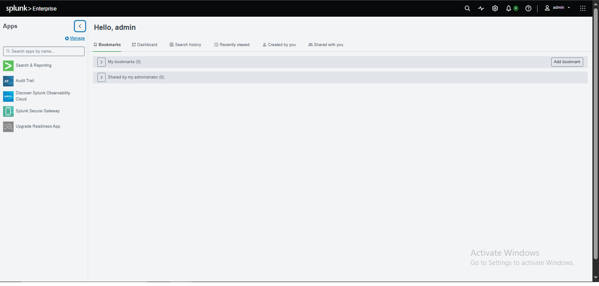

# Week 4 — Task 10: What is SIEM? + Install Splunk / Wazuh


## Project Overview

This project covers the fundamentals of **Security Information and Event Management (SIEM)** and demonstrates a working Splunk-based SIEM lab.

A SIEM collects security-relevant logs from multiple sources, brings them into a central platform, normalizes and correlates data, supports detection and alerting, and provides dashboards for investigation and reporting.

For this task, the existing Splunk lab was reused rather than installing a second SIEM such as Wazuh. This avoided unnecessary resource usage while still completing the required practical objective of accessing a working SIEM dashboard.

## Objectives

The objectives of this project were:

1. Understand what SIEM means.
2. Understand centralized log collection.
3. Understand log normalization and correlation.
4. Understand alerting and detection.
5. Understand SIEM dashboards and reporting.
6. Complete the required TryHackMe **Introduction to SIEM** room.
7. Access and verify the existing Splunk SIEM environment.
8. Document the working dashboard with screenshots.

## What is SIEM?

**SIEM** stands for **Security Information and Event Management**.

A SIEM is a security platform that collects logs and security events from different sources, standardizes the data, correlates related events, detects suspicious activity using rules, and presents the results to security analysts.

Typical SIEM data sources include:

- Windows Event Logs
- Sysmon logs
- Linux authentication and system logs
- Firewall logs
- IDS/IPS logs
- DNS logs
- Web server logs
- Authentication systems
- Cloud services
- Endpoint security tools

## Core SIEM Functions

### 1. Centralized Log Collection

A SIEM gathers logs from multiple systems into a central location. This gives analysts a single place to search and investigate events instead of manually checking every endpoint or security device.

### 2. Log Normalization

Different devices produce logs in different formats. Normalization converts information into a consistent structure so analysts can search and compare events more easily.

### 3. Correlation

Correlation connects related events from different sources. For example, repeated failed logins followed by a successful login and unusual network activity may indicate a compromised account.

### 4. Detection and Alerting

SIEM detection rules identify conditions that may indicate suspicious or malicious behavior. When a rule matches, the SIEM can generate an alert for analyst investigation.

### 5. Dashboards and Reporting

Dashboards summarize security data through visualizations, event counts, alerts, trends, and other useful metrics. They help analysts quickly understand the security state of an environment.

## Three Benefits of SIEM

### Benefit 1 — Centralized Visibility

Security events from multiple systems can be investigated from one platform.

### Benefit 2 — Faster Detection

Correlation and detection rules can identify suspicious activity more quickly than manual log review.

### Benefit 3 — Investigation and Reporting

Searchable event data, alerts, and dashboards provide useful evidence for incident investigation and security reporting.

## Practical Environment

### SIEM Used

**Splunk** was used as the practical SIEM platform.

An existing local Splunk environment was already configured with security telemetry, so it was reused for this task instead of installing Wazuh alongside it. This was specifically done to avoid unnecessary RAM/storage consumption and to preserve the existing lab configuration.

### Dashboard Verification

The Splunk web interface was opened successfully and the administrator dashboard was accessible.

Screenshot evidence:



## TryHackMe — Introduction to SIEM

The required TryHackMe **Introduction to SIEM** room was completed.

The room covers SIEM fundamentals including:

- Log sources
- Centralized log collection
- Log normalization
- Log correlation
- Real-time alerting
- Dashboards and reporting
- Log ingestion
- Alert investigation

The room was completed at 100% as shown in the supplied evidence screenshots.


## Installation / Setup Approach

Because a functional Splunk lab was already available, the practical setup was performed by verifying and accessing the existing installation rather than installing another SIEM product.

### Steps Performed

1. Opened the existing Splunk environment.
2. Confirmed that the Splunk web interface was reachable.
3. Logged into the Splunk interface using the configured administrator account.
4. Verified that the Splunk home/dashboard interface loaded successfully.
5. Confirmed that the required SIEM learning activity was completed on TryHackMe.
6. Captured screenshots as evidence.

This approach satisfies the practical goal of demonstrating access to a working SIEM while avoiding a second heavy SIEM deployment on limited hardware.

## SOC Analyst Relevance

SIEM is one of the central technologies used by SOC analysts.

A typical SOC workflow can be represented as:

```text
Log Sources
    ↓
Log Collection / Ingestion
    ↓
Normalization / Parsing
    ↓
Correlation
    ↓
Detection Rules
    ↓
Alert
    ↓
Analyst Investigation
    ↓
Response / Escalation
```

An analyst may investigate:

- Failed authentication attempts
- Successful logins from unusual locations
- Suspicious process execution
- Malware indicators
- Unusual network connections
- Privilege escalation
- Persistence activity
- Data exfiltration indicators
- Suspicious DNS activity

## Evidence Included

The `Report/` directory contains the screenshots used as evidence for this task.

| File | Evidence |
|---|---|
| `w1.png` | Working Splunk web interface/dashboard |
| `w2.png` | TryHackMe Introduction to SIEM completion evidence |
| `w3.png` | TryHackMe Introduction to SIEM completed room evidence |

## Repository Structure

```text
Week-4-Task-10-What-is-SIEM-Install-Splunk/
│
├── README.md
├── Week-4-Task-10-What-is-SIEM-Install-Splunk.pdf
│
└── Report/
    ├── report.md
    ├── w1.png
    ├── w2.png
    └── w3.png
```

## Final Result

The task requirements were covered through:

- SIEM definition and explanation
- Three major SIEM benefits
- Existing Splunk SIEM environment verification
- Working Splunk dashboard evidence
- TryHackMe Introduction to SIEM completion evidence
- Explanation of centralized collection, normalization, correlation, alerting, and dashboards
- SOC analyst relevance

## Report

Full report: [report/Report.md](Report/report.md)

> **Note:** The actual report filename is `report.md` and the link above points to that exact file path using the repository's case-sensitive path convention.
