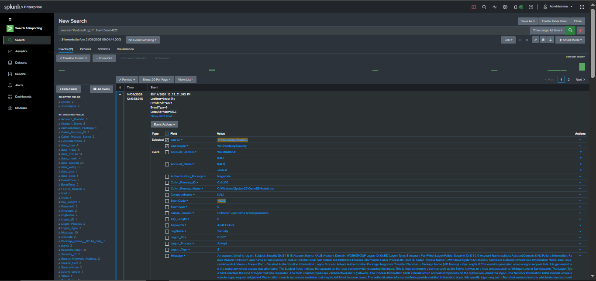
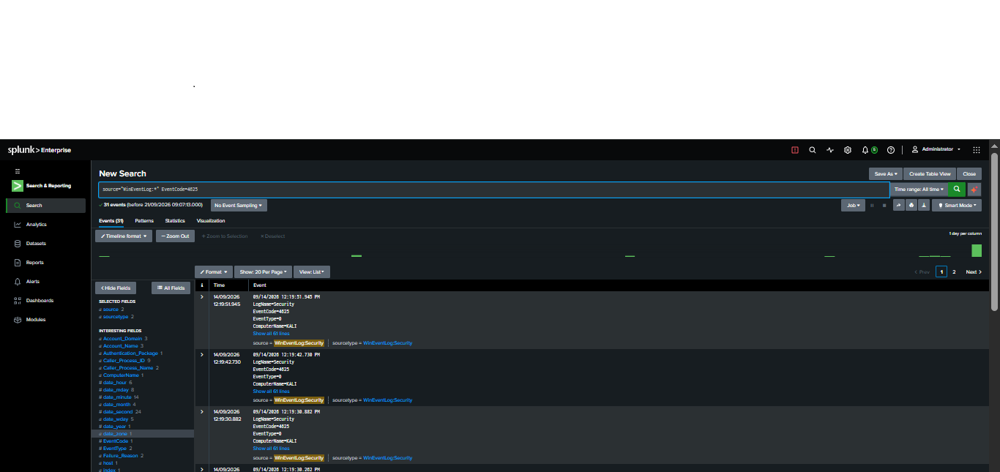
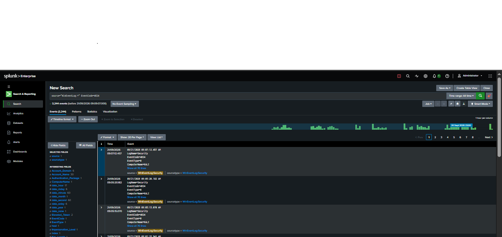
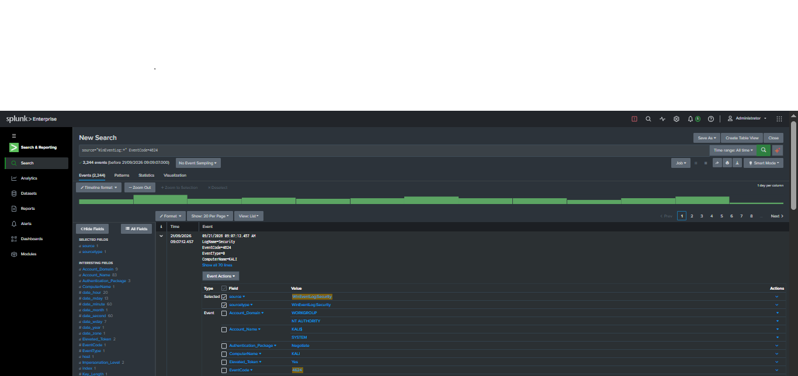
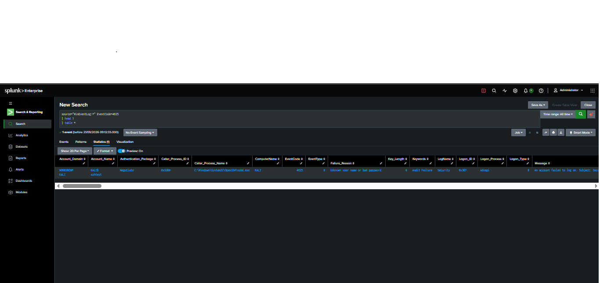
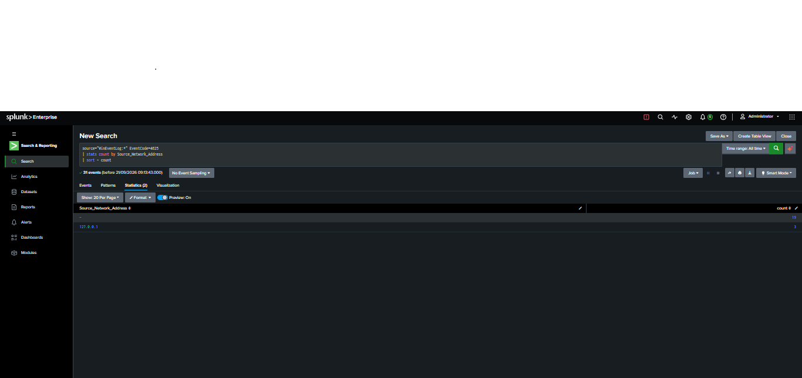
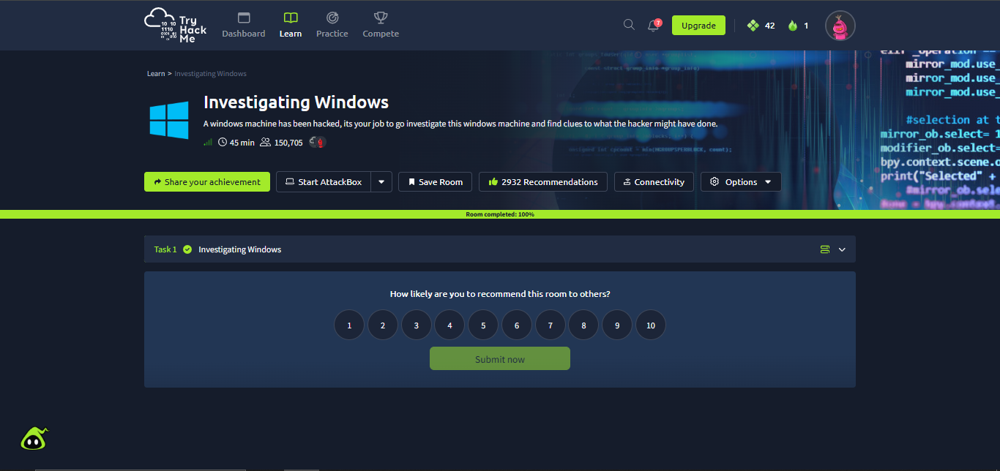

# Week 5 – Task 15: Incident Detection — Investigate an Attack in Logs

**Intern:** Mudasir Zia
**Company:** TechBiz Academy — Cybersecurity Internship
**Date:** September 21, 2026

---

## 1. Objective
Detect and investigate a brute-force/suspicious login attack using Windows Security logs in Splunk: find the failed-login spike (4625), identify source + attempt count, check for a related success (4624), and build an attack timeline.

## 2. Tool / Environment
- **SIEM:** Splunk Enterprise
- **Log source:** `WinEventLog:Security`
- **Host under investigation:** `KALI`

## 3. Failed Logon Detection (Event ID 4625)
**Query:** `source="WinEventLog:*" EventCode=4625`

| Field | Value |
|---|---|
| Total failed logon events | **31** |
| Account targeted | `sshtest` |
| Domain | WORKGROUP |
| Computer | KALI |
| Logon Type | 8 (NetworkCleartext — used by services like SSH) |
| Caller Process | `C:\Windows\System32\OpenSSH\sshd.exe` |
| Failure Reason | Unknown user name or bad password |
| Keywords | Audit Failure |

**Finding:** All 31 failed attempts targeted the same non-existent/invalid account (`sshtest`) via the OpenSSH service on host KALI — a classic brute-force/password-guessing pattern against SSH.

## 4. Source Analysis
**Query:** `source="WinEventLog:*" EventCode=4625 | stats count by Source_Network_Address`

| Source Network Address | Count |
|---|---|
| (blank/not logged) | 19 |
| 127.0.0.1 (localhost) | 3 |

**Finding:** The attack originated from the same machine (localhost, `127.0.0.1`) — consistent with a controlled lab/simulation environment where the attack tool was run locally against the SSH service. 19 events did not log a source address field (common when the field isn't populated by the logon type/process).

## 5. Successful Logon Check (Event ID 4624)
**Query:** `source="WinEventLog:*" EventCode=4624`

- Total 4624 events on the host: **2,244** (normal system/service activity, unrelated baseline volume)
- Sampled 4624 events show `Account_Name=SYSTEM`, `Account_Domain=NT AUTHORITY` — standard OS/service logons, **not** the `sshtest` account used in the attack.

**Finding: No successful logon (4624) was found for the `sshtest` account or matching the attack's source/timeframe.** The brute-force attempt **failed** — attacker did not gain access.

## 6. Attack Timeline
| Time (PM) | Event |
|---|---|
| 12:19:30.882 | Failed logon attempt #1 (4625) — account `sshtest` |
| 12:19:42.738 | Failed logon attempt #2 (4625) — account `sshtest` |
| 12:19:51.945 | Failed logon attempt #3 (4625) — account `sshtest` |
| ... | Pattern repeats — 31 total failed attempts in rapid succession |
| — | **No 4624 success event ever recorded for this account** |

Attempts occurred within seconds of each other — automated/scripted brute-force behavior, not manual human login attempts.

## 7. Verdict
- **Attack type:** SSH Brute-Force / Password-Guessing Attack
- **Target account:** `sshtest`
- **Source:** Localhost (127.0.0.1) — lab-simulated attacker
- **Total attempts:** 31
- **Success:** **No** — all 31 attempts failed
- **Recommendation:** Lock/disable unused `sshtest` account, enable account lockout after N failed attempts, monitor OpenSSH logon failures, and alert on high-frequency 4625 events from a single process/source.

## 8. TryHackMe Room Completed (Proof)
**Room:** Investigating Windows — **100% completed**

## 9. Screenshots

### Splunk — 4625 Failed Logon Search (Event Detail)

### Splunk — 4625 Event List (Timeline of Attempts)

### Splunk — 4624 Successful Logon Search (2,244 events)

### Splunk — 4624 Event Detail (SYSTEM account, unrelated to attack)

### Splunk — 4625 Event Table (Account, Process, Failure Reason)

### Splunk — Source Network Address Breakdown

### TryHackMe — Investigating Windows (Room Completed 100%)

---
*End of report.*
