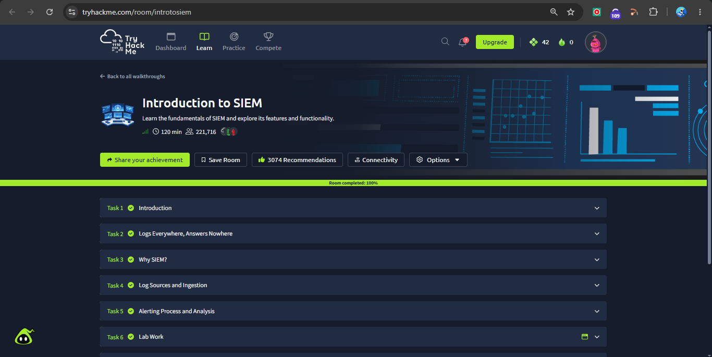
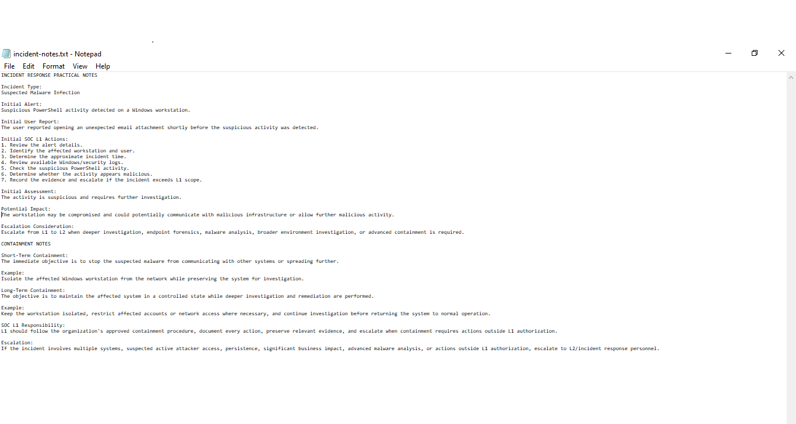
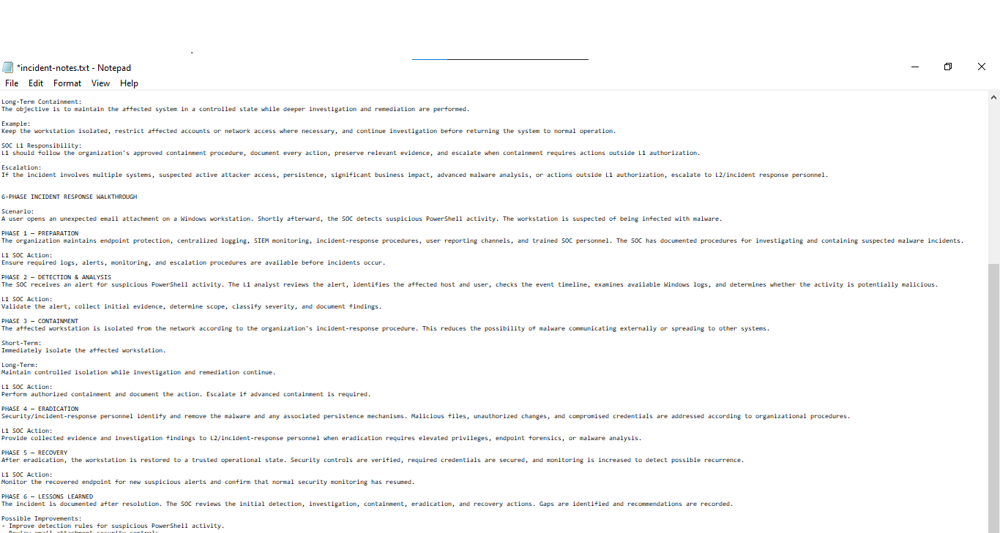
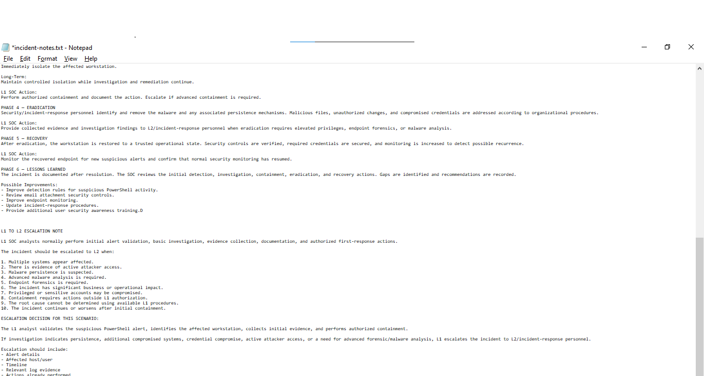

# Week 6 – Task 16: Incident Response Process (NIST Phases)

**Intern:** Mudasir Zia
**Company:** TechBiz Academy — Cybersecurity Internship
**Date:** September 24, 2026

---

## 1. Objective
Understand the NIST SP 800-61 Incident Response lifecycle (6 phases), apply it to a malware-infection scenario, and define L1→L2 escalation criteria.

## 2. The 6 NIST IR Phases (One Line Each)
1. **Preparation** — Have logging, monitoring, tools, procedures, and trained staff ready *before* an incident happens.
2. **Detection & Analysis** — Identify and validate the alert, scope the affected host/user, and determine if it's malicious.
3. **Containment** — Stop the threat from spreading (short-term: isolate immediately; long-term: keep it controlled while investigating).
4. **Eradication** — Remove the malware and any persistence mechanisms from the environment.
5. **Recovery** — Restore the system to normal, verified-clean operation and monitor for recurrence.
6. **Lessons Learned** — Review the whole incident afterward and fix the gaps that let it happen.

## 3. Containment: Short-Term vs Long-Term
| Type | Goal | Example |
|---|---|---|
| **Short-Term** | Immediately stop spread/communication | Isolate the infected workstation from the network right away, while preserving it for investigation |
| **Long-Term** | Hold the system in a controlled state during deeper investigation | Keep it isolated, restrict affected accounts/network access, don't restore to production until root cause is confirmed |

**L1 Responsibility:** Follow the approved containment procedure, document every action, preserve evidence, and escalate if containment needs actions beyond L1 authorization.

## 4. Scenario Walkthrough — Suspected Malware Infection

**Scenario:** A user opens an unexpected email attachment on a Windows workstation. The SOC then detects suspicious PowerShell activity on that host.

| Phase | What Happens |
|---|---|
| **Preparation** | Endpoint protection, centralized logging, SIEM, and documented IR procedures are already in place before this incident occurs. |
| **Detection & Analysis** | SOC gets an alert for suspicious PowerShell activity. L1 identifies the host/user, checks the timeline, reviews Windows logs, and assesses whether it's malicious. |
| **Containment** | Affected workstation is isolated from the network (short-term) and kept isolated while investigation continues (long-term). |
| **Eradication** | L2/IR personnel remove the malware and any persistence mechanisms; compromised credentials are reset. |
| **Recovery** | Workstation restored to a trusted state, security controls verified, monitoring increased to catch recurrence. |
| **Lessons Learned** | SOC reviews detection-to-recovery timeline, identifies gaps, and records improvements. |

**Initial L1 SOC Actions Taken:**
1. Reviewed alert details
2. Identified affected workstation and user
3. Determined approximate incident time
4. Reviewed available Windows/security logs
5. Checked the suspicious PowerShell activity
6. Assessed whether activity is malicious
7. Recorded evidence and prepared for escalation if needed

**Initial Assessment:** Activity is suspicious and requires further investigation.
**Potential Impact:** Workstation may be compromised; risk of communication with malicious infrastructure or further malicious activity.

**Possible Improvements Identified (Lessons Learned):**
- Improve detection rules for suspicious PowerShell activity
- Review email attachment security controls
- Improve endpoint monitoring
- Update incident-response procedures
- Additional user security-awareness training

## 5. L1 → L2 Escalation Note

L1 normally handles: initial alert validation, basic investigation, evidence collection, documentation, and authorized first-response actions.

**Escalate to L2 when:**
1. Multiple systems appear affected
2. Evidence of active attacker access
3. Malware persistence is suspected
4. Advanced malware analysis is required
5. Endpoint forensics is required
6. Significant business/operational impact
7. Privileged or sensitive accounts may be compromised
8. Containment requires actions outside L1 authorization
9. Root cause can't be determined with L1 procedures
10. Incident continues/worsens after initial containment

**Escalation Decision for This Scenario:**
L1 validates the alert, identifies the affected workstation, collects initial evidence, and performs authorized containment. If investigation shows persistence, additional compromised systems, credential compromise, active attacker access, or a need for advanced forensics/malware analysis, L1 escalates to L2/IR personnel with:
- Alert details
- Affected host/user
- Timeline
- Relevant log evidence
- Actions already performed
- Containment status
- Reason for escalation
- Current suspected impact

## 6. TryHackMe Room Completed (Proof)
**Room:** Introduction to SIEM — **100% completed** (all 6 tasks)

## 7. Screenshots

### TryHackMe — Introduction to SIEM (Room Completed 100%)

### Practical Notes — Incident Response Documentation (Part 1)

### Practical Notes — Incident Response Documentation (Part 2)

### Practical Notes — Incident Response Documentation (Part 3)

---
*End of report.*
