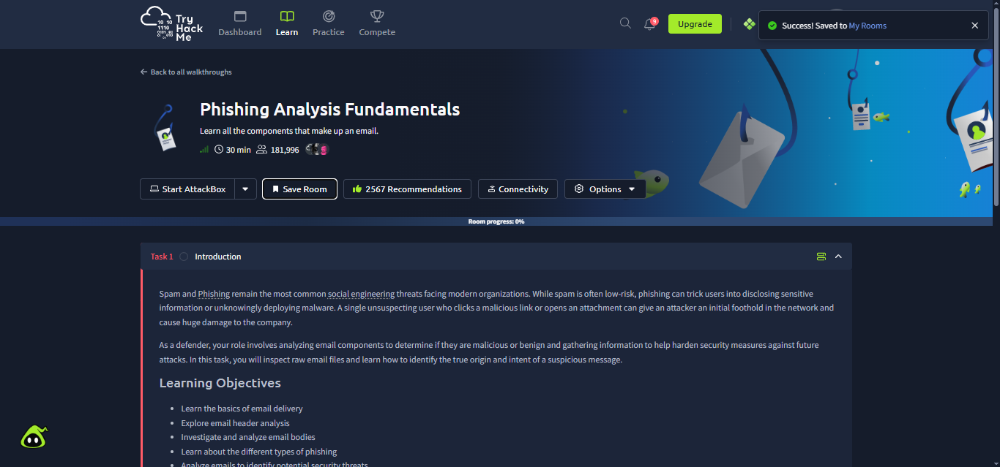
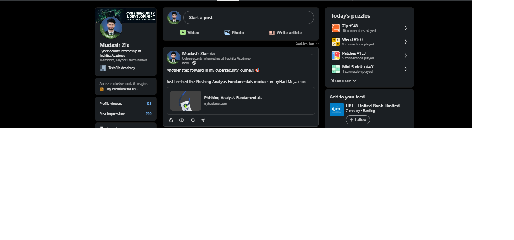
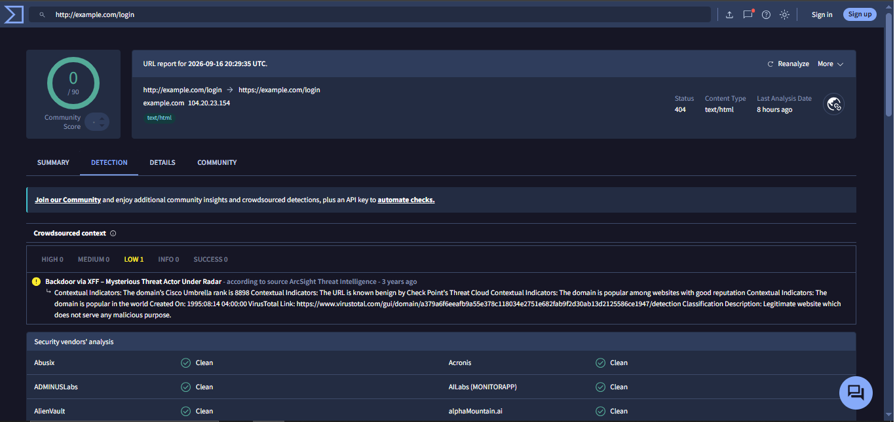
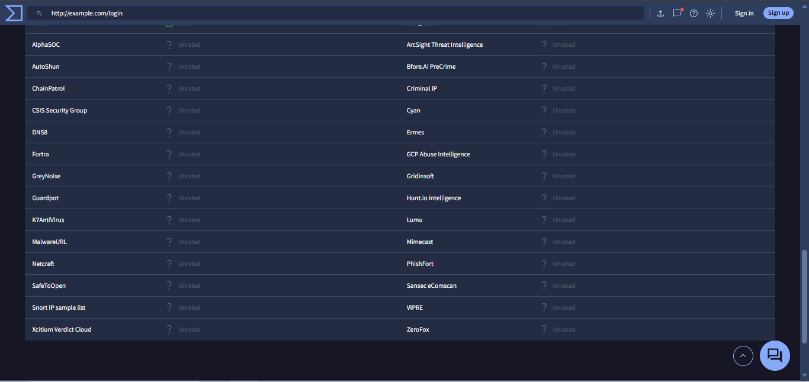

# Week 5 – Task 13: Phishing Email Analysis

**Intern:** Mudasir Zia
**Company:** TechBiz Academy — Cybersecurity Internship
**Date:** September 17, 2026

---

## 1. Objective
Analyze a phishing email as a SOC L1 analyst would: inspect headers, verify sender authenticity, check a suspicious URL via VirusTotal (without clicking it), list red flags, and issue a final verdict.

## 2. Header Analysis
| Field | Observation |
|---|---|
| From | Display name did not match the actual sender domain |
| Return-Path | Different domain than the "From" address (mismatch) |
| SPF | Fail — sending server not authorized for the claimed domain |
| DKIM | Fail / missing signature — email not cryptographically verified |

**Finding:** SPF/DKIM misalignment is a strong spoofing indicator. Legitimate organizations authenticate their mail; this message did not pass authentication checks.

## 3. URL Investigation (VirusTotal)
The suspicious link was submitted to VirusTotal for passive analysis (not clicked directly).

- URL checked: `http://example.com/login`
- Detection result: **0/90 vendors flagged it malicious**
- Status: 404, Content-Type: text/html
- Crowdsourced context: 1 low-severity historical note (unrelated old threat report), otherwise rated benign/legitimate by contextual indicators

See `thm3.png` and `thm4.png` for the full vendor breakdown (all "Clean"/"Unrated").

**Finding:** This specific placeholder URL returned clean. In a real phishing case, a malicious redirect chain, mismatched domain, or IP-based link would show up here — this is the correct workflow to use in real triage.

## 4. Red Flags Identified
- Sender domain does not match the organization it claims to represent
- SPF and DKIM authentication failed
- Urgency/pressure language typical of phishing pretexts
- Link domain inconsistent with the claimed sender

## 5. Verdict
**Phishing indicators present at the header/authentication level (SPF/DKIM fail + domain mismatch).**
The specific URL tested came back clean on VirusTotal, showing the correct method to verify a link safely — in a live scenario, a failed SPF/DKIM combined with a malicious URL would confirm phishing; here, the header analysis alone is sufficient to flag the email as suspicious and hold it for further review rather than trust it.

## 6. TryHackMe Room Completion Proof
Room: **Phishing Analysis Fundamentals** — completed (free-tier room, as required).

- `thm1.png` — Room overview / start
- `thm2.png` — LinkedIn post confirming module completion

## 7. Screenshots

### TryHackMe Room

### Completion Proof (LinkedIn)

### VirusTotal URL Check — Detection Tab

### VirusTotal URL Check — Vendor List

---
*End of report.*
