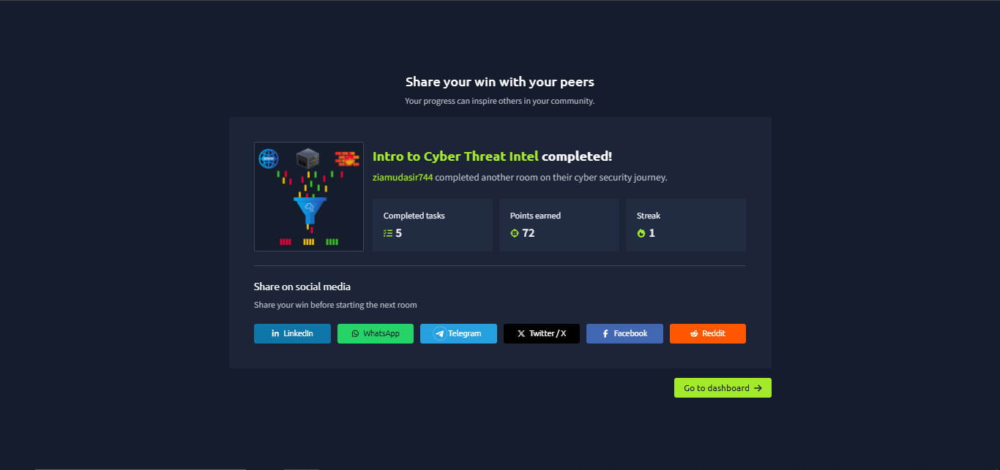
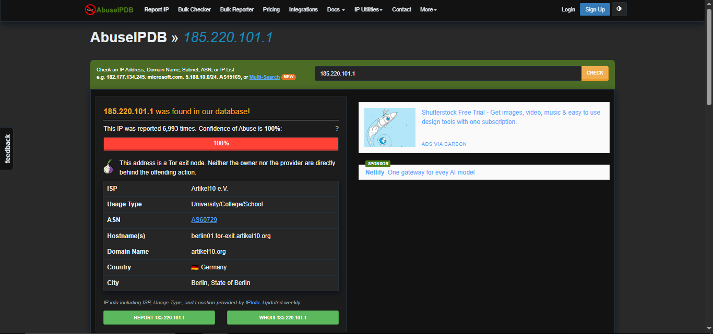
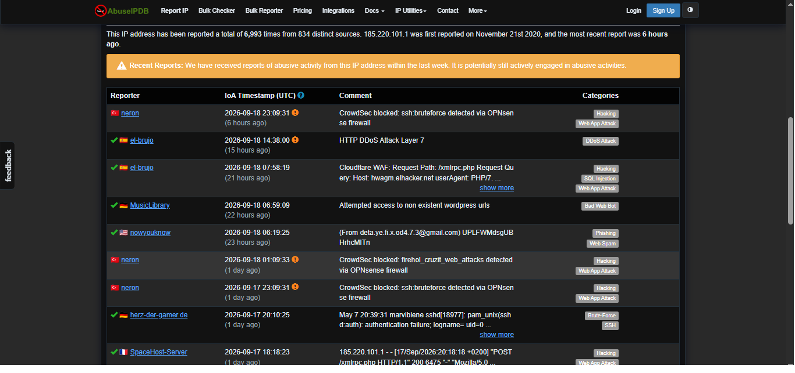
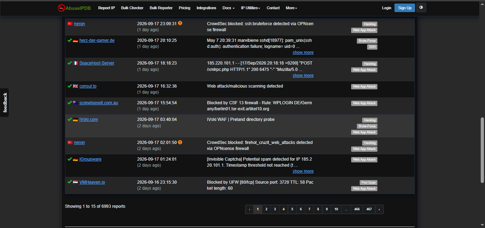
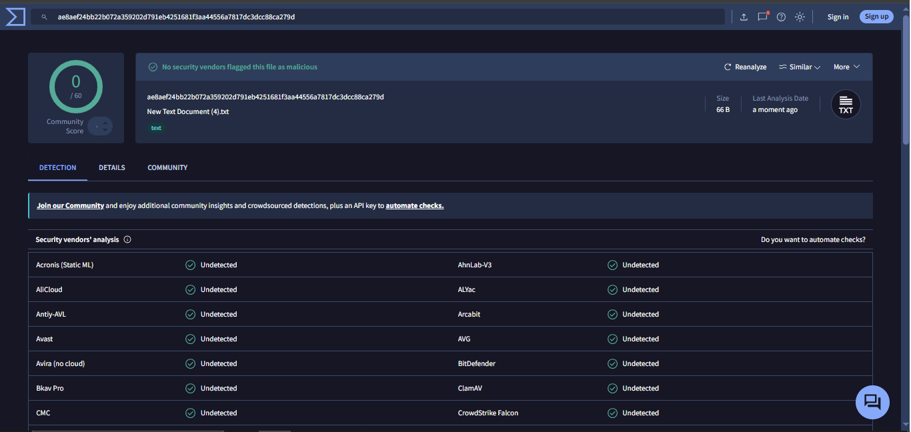
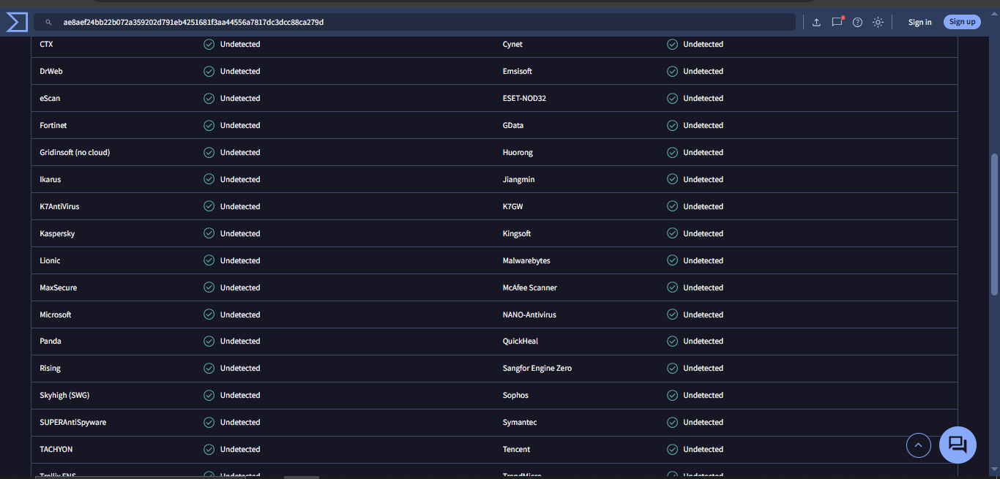
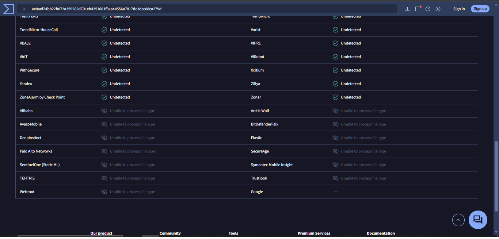

# Week 5 – Task 14: Threat Intelligence & IOCs

**Intern:** Mudasir Zia
**Company:** TechBiz Academy — Cybersecurity Internship
**Date:** September 19, 2026

---

## 1. Objective
Understand core IOC (Indicator of Compromise) types and practice checking a suspicious IP and a file hash using free threat-intel tools (AbuseIPDB, VirusTotal), then issue a verdict.

## 2. IOC Types
| Type | Example | Use |
|---|---|---|
| IP Address | 185.220.101.1 | Identify malicious hosts, scanners, C2 servers |
| Domain | evil-domain.com | Phishing/malware delivery infrastructure |
| URL | http://bad-site.com/payload | Malicious links, drop sites |
| File Hash (MD5/SHA1/SHA256) | ae8aef24bb...ca279d | Uniquely identify a file regardless of name, check against malware databases |

## 3. IP Reputation Check — AbuseIPDB
**IP checked:** `185.220.101.1`

| Field | Result |
|---|---|
| Abuse Confidence | **100%** |
| Total Reports | 6,993 reports from 834 distinct sources |
| First Reported | November 21, 2020 |
| Last Reported | 6 hours ago (still active) |
| Type | Tor exit node |
| ISP / Location | Artikel10 e.V. — Berlin, Germany |
| Reported Categories | Hacking, Web App Attack, DDoS, Brute-Force, SSH abuse, Phishing, Port Scan |

**Finding:** This IP is a known Tor exit node with a long, continuous history of SSH brute-force, WAF-blocked attacks, DDoS, and phishing-related activity across hundreds of independent reporters. 100% confidence + recent activity (6 hrs ago) = actively malicious infrastructure, not a one-off false positive.

## 4. File Hash Check — VirusTotal
**Hash checked:** `ae8aef24bb22b072a359202d791eb4251681f3aa44556a7817dc3dcc88ca279d`

| Field | Result |
|---|---|
| Detection | **0 / 60 vendors flagged malicious** |
| File | New Text Document (4).txt, 66 B |
| Verdict shown | "No security vendors flagged this file as malicious" |

**Finding:** This is a clean, benign text file — correctly demonstrates the VirusTotal hash-lookup workflow used to triage suspicious file hashes before opening/executing them.

## 5. Overall Verdict
- **IP 185.220.101.1 → Malicious / High-Risk.** Block at firewall level, treat any traffic to/from it as suspicious (Tor exit + confirmed attack history).
- **File hash → Benign.** No further action needed.

This mirrors real SOC L1 triage: cross-check every unknown IOC against reputation sources before deciding, and don't assume "unknown" means "safe."

## 6. TryHackMe Rooms Completed (Proof)
Both mandatory free-tier rooms completed:
- **Intro to Cyber Threat Intel**
- **Threat Intelligence Tools**

## 7. Screenshots

### TryHackMe — Intro to Cyber Threat Intel (Room Start)

### TryHackMe — Room Completed (5 tasks, 72 points)

### Completion Proof (LinkedIn)

### AbuseIPDB — IP Reputation Summary

### AbuseIPDB — Report History (Page 1)

### AbuseIPDB — Report History (Page 2)

### VirusTotal — Hash Detection Summary

### VirusTotal — Vendor List (Part 1)

### VirusTotal — Vendor List (Part 2)

---
*End of report.*
