# 🔐 Week 2 · Task 4 — Linux Basics + Log Files (/var/log)


---

## 📌 1. Introduction

This report documents the practical work completed for **Week 2 · Task 4 — Linux Basics + Log Files (/var/log)**.

The purpose of this task was to build foundational Linux knowledge from a **Security Operations Center (SOC) analyst perspective**, with special focus on Linux commands and system log files.

Linux logs are important to defenders because they provide evidence of system activity, user actions, authentication events, scheduled tasks, errors, and potentially suspicious behaviour. SOC analysts regularly inspect, filter, correlate, and investigate logs during security monitoring and incident response.

---

## 🎯 2. Task Objectives

The objectives of this project were to:

1. Complete the required Linux and log-analysis learning activities.
2. Practice essential Linux navigation and file-viewing commands.
3. Explore the `/var/log` directory.
4. View log data using `cat`.
5. Inspect recent log entries using `tail`.
6. Practice searching log content with `grep`.
7. Understand how Linux logs support cybersecurity investigations.
8. Document the completed work with original screenshots.

---

# 🎓 3. TryHackMe Learning Evidence

## 3.1 Linux Fundamentals Part 1

The **Linux Fundamentals Part 1** room was completed to practice core Linux concepts and commands relevant to cybersecurity.

The learning included Linux navigation and command-line fundamentals that support later SOC and log-analysis work.

### Screenshot Evidence

#### Linux Fundamentals Evidence 1

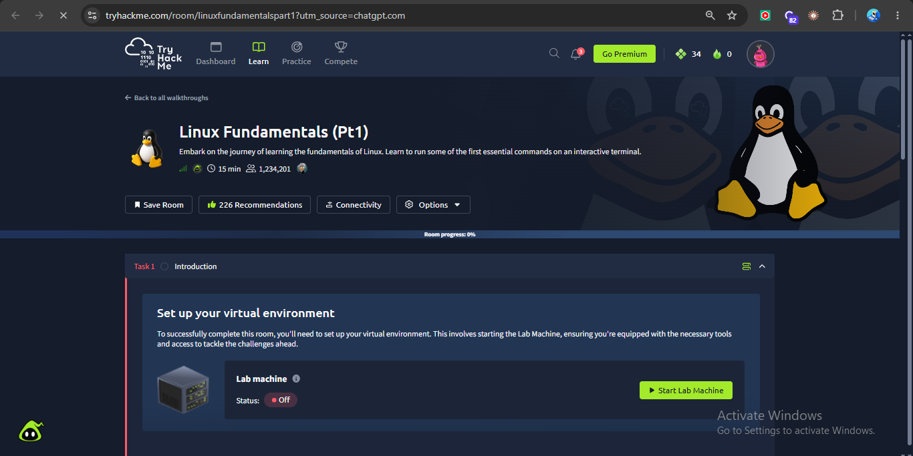

#### Linux Fundamentals Evidence 2

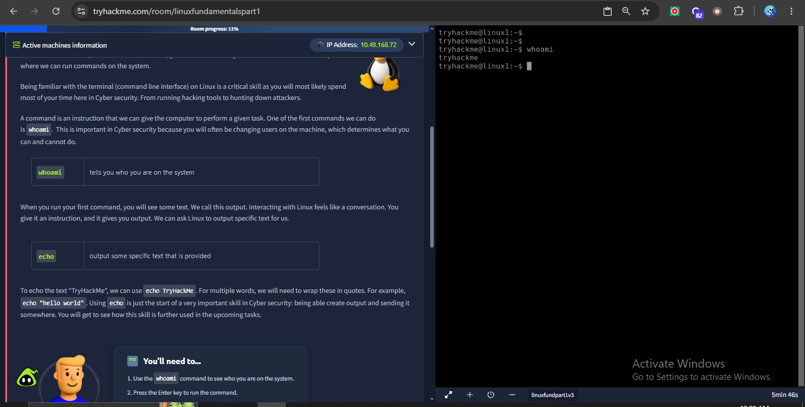

#### Linux Fundamentals Evidence 3

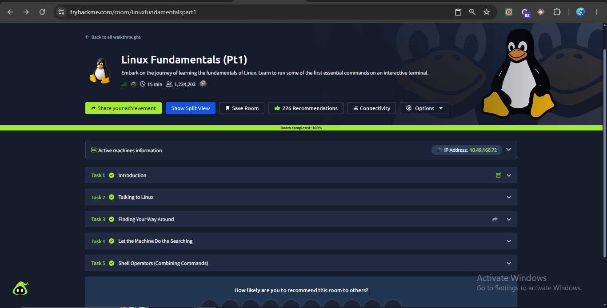

---

## 3.2 Intro to Logs

The **Intro to Logs** room was completed to develop an understanding of log generation, storage, retention, rotation, parsing, normalisation, correlation, and analysis.

This room connected Linux command-line skills with practical security monitoring and log investigation.

### Screenshot Evidence

#### Intro to Logs Evidence 1

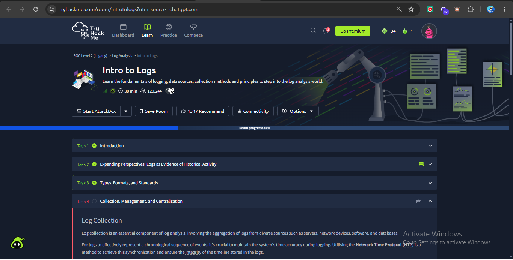

#### Intro to Logs Evidence 2

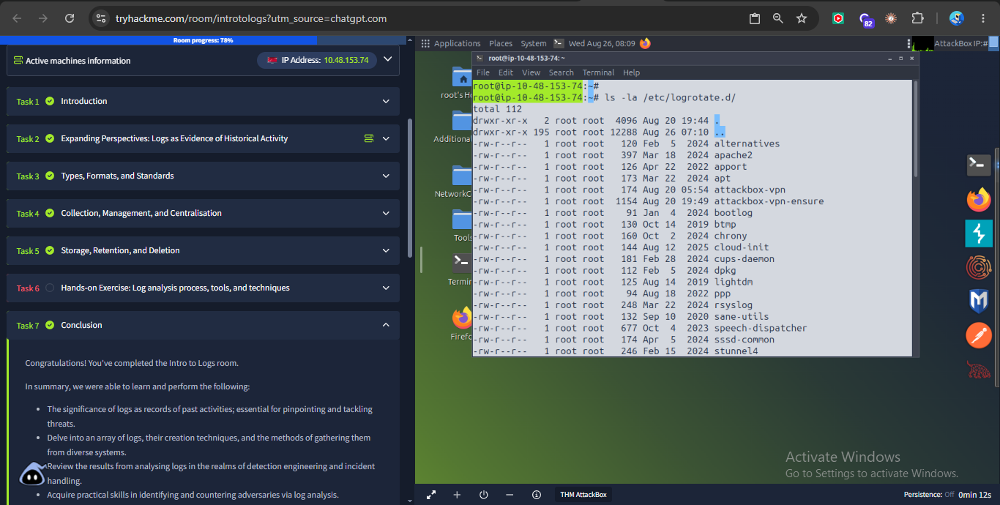

#### Intro to Logs Evidence 3

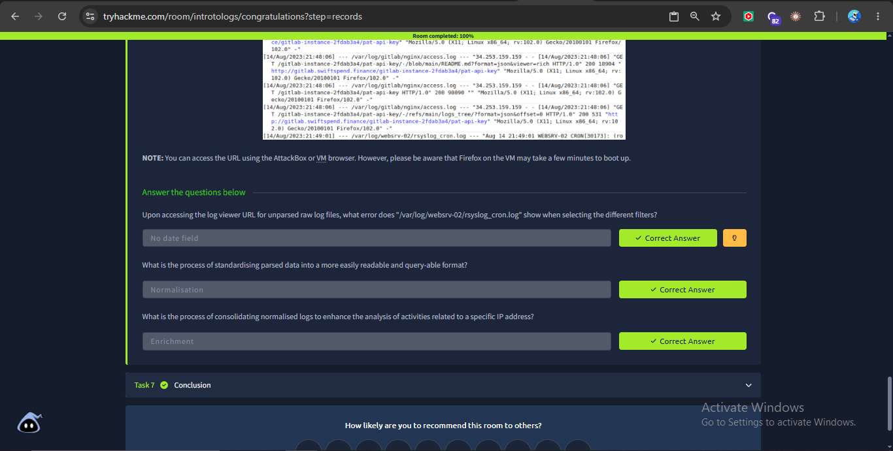

---

# 🐧 4. Linux Command Practice

The following commands were practiced as part of the Linux practical work.

## `pwd`

The `pwd` command displays the current working directory.

```bash
pwd
```

This is useful when navigating a Linux system and confirming the current location before accessing files.

## `ls`

The `ls` command lists files and directories.

```bash
ls
```

A SOC analyst may use this command to inspect available files, including logs and configuration files.

## `cd`

The `cd` command changes the current directory.

```bash
cd /var/log
```

This command was used to navigate to the main Linux log directory.

### Screenshot Evidence

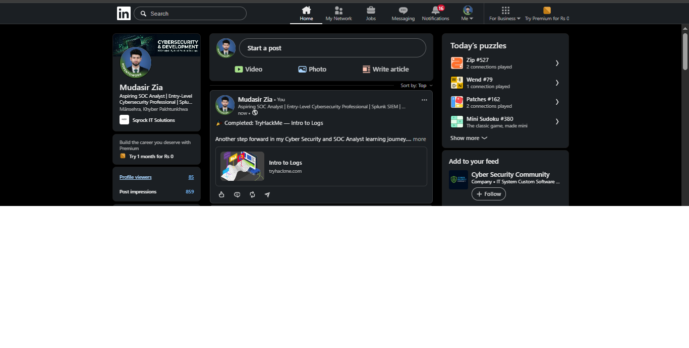

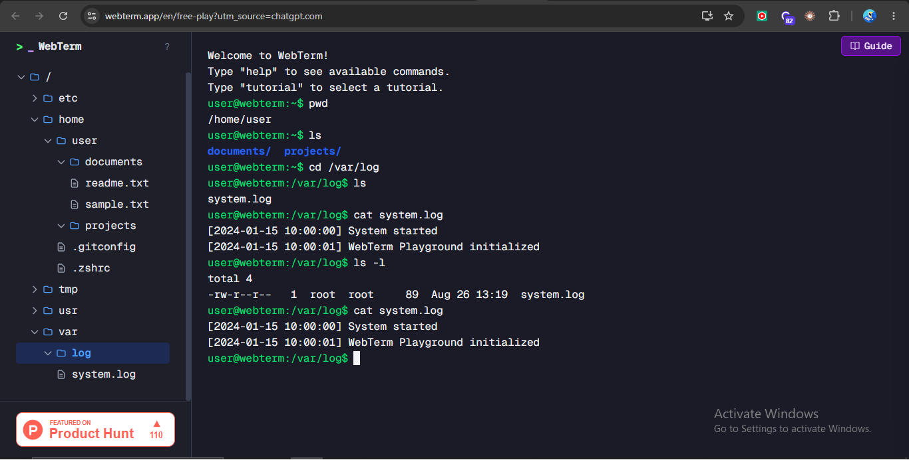

---

# 📂 5. Exploring `/var/log`

The `/var/log` directory is a major location for Linux system and application logs.

Different systems may contain different log files depending on the installed services and Linux distribution. Common log-related files can include authentication, system, application, service, and package-management logs.

Exploring `/var/log` is important for SOC work because logs can help answer questions such as:

- Who attempted to authenticate?
- What service generated an event?
- When did an event occur?
- Was a command or scheduled task executed?
- Did an error or suspicious event occur?

### Screenshot Evidence

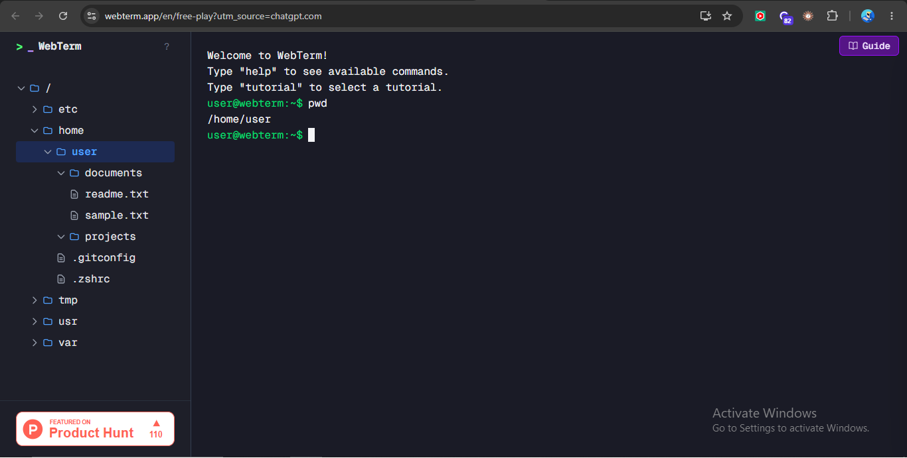

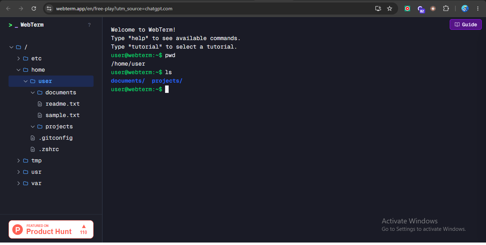

---

# 📄 6. Viewing Log Files with `cat`

The `cat` command can display the contents of a file directly in the terminal.

Example:

```bash
cat <log-file>
```

For smaller files, this provides a quick way to inspect raw log entries.

From a defensive perspective, viewing raw logs helps an analyst understand:

- Timestamp formats
- Hostnames
- Process names
- User accounts
- Commands
- Event messages

### Screenshot Evidence

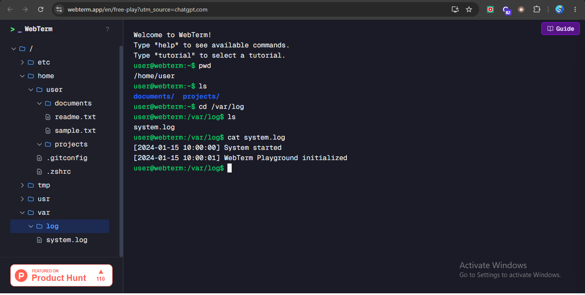

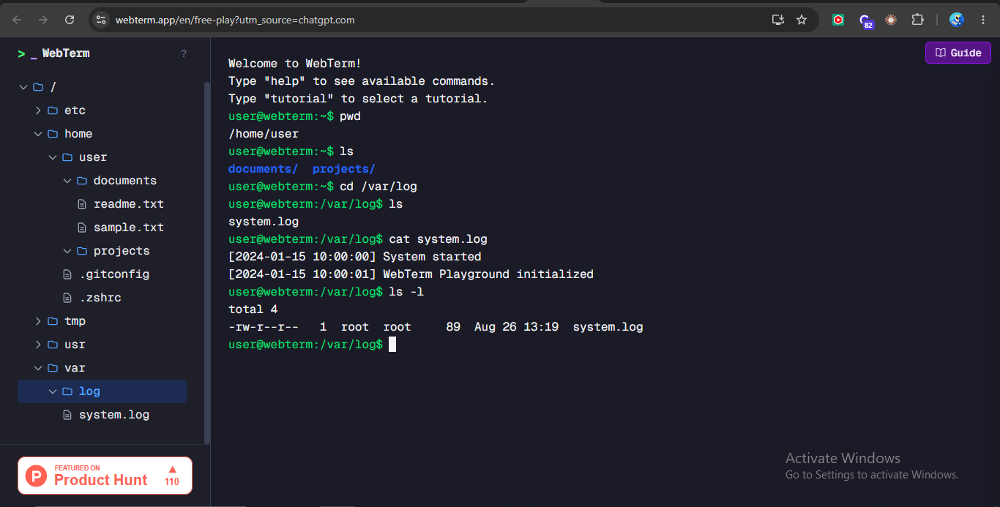

---

# ⏱️ 7. Inspecting Recent Events with `tail`

The `tail` command is used to display the end of a file.

Example:

```bash
tail <log-file>
```

By default, `tail` shows the last 10 lines.

A specific number of lines can also be requested:

```bash
tail -n 20 <log-file>
```

This is useful when an analyst wants to quickly inspect the newest events in a growing log file.

### Screenshot Evidence

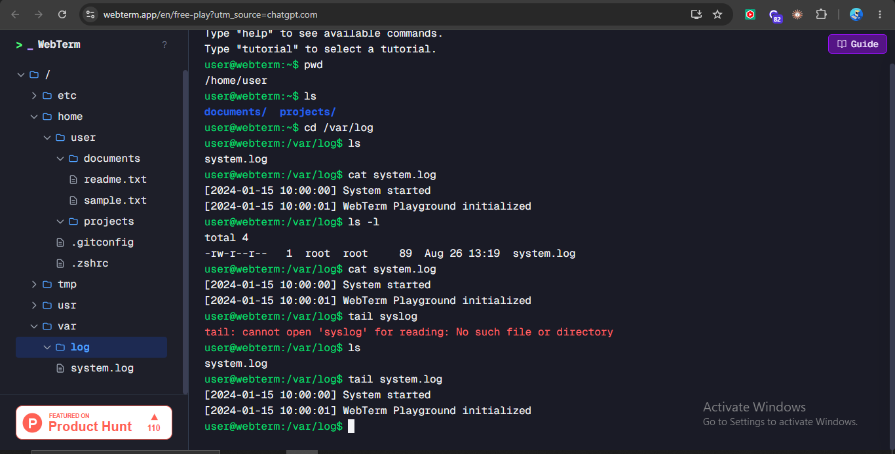


---

# 🔎 8. Searching Logs with `grep`

The `grep` command searches text for matching patterns.

A task requirement was to understand how a defender can search authentication logs for failed logins. The required pattern is:

```bash
grep 'Failed' auth.log
```

Depending on the Linux environment, the exact log filename and available authentication events may differ. The important concept is filtering a large log file to quickly locate matching security events.

Examples:

```bash
grep 'Failed' auth.log
grep 'error' <log-file>
grep 'root' <log-file>
```

For SOC analysts, `grep` is useful for quickly searching for:

- Failed authentication attempts
- Specific IP addresses
- Usernames
- Error messages
- Suspicious commands
- Known indicators of compromise

---

# 👀 9. Live Log Monitoring with `tail -f`

The `-f` option allows `tail` to continue watching a file as new lines are added.

Example:

```bash
tail -f <log-file>
```

This is useful for near-real-time monitoring during troubleshooting or incident investigation.

To stop live monitoring:

```text
Ctrl + C
```

---

# 🛡️ 10. Why Linux Logs Matter in Cybersecurity

Linux logs are an important source of evidence for a SOC analyst.

They can support:

- Authentication monitoring
- Detection of failed login attempts
- Investigation of suspicious commands
- Service and application troubleshooting
- Timeline reconstruction
- Incident response
- Detection of unusual activity

A basic investigation can begin with a simple command-line search, while larger environments commonly centralise logs in platforms such as a SIEM.

---

# 🔄 11. Log Analysis Concepts Learned

The Intro to Logs learning covered several stages of log analysis:

| Stage | Purpose |
|---|---|
| Data Sources | Systems or applications that generate logs |
| Parsing | Breaking log data into manageable components |
| Normalisation | Standardising parsed data into a consistent format |
| Sorting | Organising log entries for easier analysis |
| Classification | Categorising events by characteristics |
| Enrichment | Adding useful context to events |
| Correlation | Linking related events and records |
| Visualisation | Presenting data through charts or other visual formats |
| Reporting | Summarising findings for analysts and stakeholders |

These concepts are directly relevant to SOC monitoring and SIEM platforms.

---

# 🧰 12. Tools and Commands Practiced

| Command / Tool | Purpose |
|---|---|
| `pwd` | Show current directory |
| `ls` | List files and directories |
| `cd` | Change directory |
| `cat` | Display file contents |
| `tail` | Display the last lines of a file |
| `tail -f` | Monitor new log entries |
| `grep` | Search for matching text or patterns |
| TryHackMe | Interactive cybersecurity learning |
| Linux terminal environment | Practical command-line and log exploration |

---

# 📚 13. Key Learning Outcomes

After completing this project, I improved my understanding of:

- Linux command-line navigation
- The purpose of `/var/log`
- Viewing log files
- Inspecting recent events
- Searching logs with patterns
- Authentication and security-related log analysis concepts
- Log retention and rotation
- Parsing and normalisation
- Correlation of related log events
- The relationship between Linux logs, SOC analysis, and SIEM platforms

---

# 🏁 14. Conclusion

This project provided practical exposure to Linux commands and log analysis from a defender's perspective.

The most important lesson was that **logs are security evidence**. A SOC analyst must be able to locate logs, understand their structure, search for relevant events, inspect recent activity, and connect related information during an investigation.

The skills practiced in this task form a foundation for more advanced SOC work involving:

- Centralised logging
- SIEM platforms
- Detection engineering
- Threat hunting
- Incident response
- Security investigations

---

## 📎 Screenshot Files Used

All screenshots in this report are the original evidence files supplied for this project:

```text
l1.png
l2.png
l3.png
l4.png
l5.png
l6.png
l7.png
l8.png
l9.png
l10.png
l11.png
l12.png
l13.png
l14.png
l15.png
l16.png
l17.png
l18.png
```
